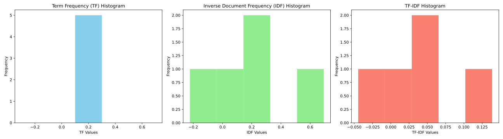

#  Bag of Words (BoW) 

The Bag of Words (BoW) model is a technique to represent images a collection of "words" without considering the order or structure of these words. "words" are actually  **clusters of similar features** i.e SIFT, ORB features in an image. The process typically involves:

1. **Feature Extraction:** Extracting features from each image using feature detectors such as SIFT, SURF, or ORB.

2. **Clustering:** Grouping all the features from all the images into clusters. Each cluster represents a "visual word". This is often done using the K-means clustering algorithm.

3. **Histogram Construction:** For each image, constructing a histogram that counts the number of features in each cluster.

4. **Classification:** Using the histogram as a feature vector for further tasks such as image classification.


### 1. Feature Extraction
so first extract **features descriptors** from every image, every image has different numbers of them, so `all_features` is  list with different element size.

```python
import cv2
import numpy as np

# Initialize SIFT detector
sift = cv2.SIFT_create()

# Placeholder for storing features from all images
all_features = []

# Assuming you have a list of image paths from the KITTI dataset
image_paths = ["path/to/image1.png", "path/to/image2.png", ...]

for image_path in image_paths:
    image = cv2.imread(image_path)
    gray = cv2.cvtColor(image, cv2.COLOR_BGR2GRAY)
    
    # Detect and compute SIFT features
    keypoints, descriptors = sift.detectAndCompute(gray, None)
    all_features.append(descriptors)
```

### 2. Build Vocabulary
Next cluster all **features descriptors** i.e using K-means and call the cenetroid of these clusters as "vocabulary"

```python
from scipy.cluster.vq import kmeans, vq

# Stack all the descriptors vertically in a numpy array
all_features_stacked = np.vstack(all_features)

# Define the number of visual words
k = 100  # For example, 100 visual words

# Perform k-means clustering to find visual words
voc, variance = kmeans(all_features_stacked, k, 1)
```

The `kmeans` function in the line `voc, variance = kmeans(all_features_stacked, k, 1)` performs k-means clustering on the input data (`all_features_stacked`) and aims to partition the data into `k` clusters. It returns two main outputs:

1. **`voc`**: This is the set of `k` cluster centroids, representing the center of each cluster in the feature space. These centroids can be thought of as the "visual words" in the context of a Bag of Words (BoW) model. Each centroid is a point in the same dimensional space as the input features and serves as a representative of the features that are assigned to that cluster. In the context of image processing and feature extraction, each centroid could represent a common pattern or part of an image.

2. **`variance`**: This represents the average (or total, depending on the implementation) squared distance of the features to their closest cluster center. This value can be used as a measure of the fit of the model to the data, where a lower variance indicates a better fit. It's an indicator of how compact the clusters are, with smaller values suggesting that data points are closer to their corresponding centroids.


The line `words, distance = vq(all_features[i], voc)` uses  "vector quantization". This function performs quantization of the features to the closest centroids found in the vocabulary `voc`.

1. **`all_features[i]`**: This is the array of feature descriptors for the i-th image. These features were extracted in an earlier step, typically using a method like SIFT or ORB, and represent unique aspects of the image's visual content.

2. **`vq` Function**: The `vq` function takes each feature descriptor in `all_features[i]` and assigns it to the nearest centroid in `voc`, effectively quantizing the continuous feature space into discrete visual words. This process transforms the raw feature descriptors into a format that's more suitable for comparison and analysis.

3. **Return Values**:
   - **`words`**: This is an array of indices for each feature in `all_features[i]`. Each index corresponds to the nearest centroid in `voc` to which the feature has been assigned. Essentially, it represents the "word" from the visual vocabulary that best matches each feature descriptor.
   - **`distance`**: This is an array of the distances from each feature in `all_features[i]` to its closest centroid in `voc`. This can give you an idea of how well each feature is represented by its assigned visual word, with smaller distances indicating a better match.

The output from this line can be used for various purposes, such as constructing histograms of visual word occurrences for each image. These histograms effectively transform the images into a fixed-length feature vector based on the distribution of visual words, facilitating tasks like image classification, clustering, or retrieval in a more abstract and computationally efficient feature space.


### 3. Feature Encoding

After building the vocabulary, encode the features of each image in terms of this vocabulary to transform images into a fixed-size vector which is `mage_paths x k`.

```python
# For each set of descriptors, quantize to the visual words vocabulary
image_features = np.zeros((len(image_paths), k), "float32")
for i in range(len(image_paths)):
    words, distance = vq(all_features[i], voc)
    for w in words:
        image_features[i][w] += 1
```

This part of the code (which quantizes descriptors to visual words and then counts the occurrences of each word to create a feature vector for each image), can be done using a histogram approach.

Here's how you could rewrite that part using NumPy's `np.histogram` function, which automatically calculates the histogram of a set of data:

```python
import numpy as np

# Assuming 'k' is the number of visual words (the length of the vocabulary)
# and 'all_features' is a list of arrays where each array contains the indices
# of the visual words for a given image.

image_features = np.zeros((len(image_paths), k), dtype='float32')

for i, descriptors in enumerate(all_features):
    words, distance = vq(descriptors, voc)
    # Calculate the histogram of visual words for the current set of descriptors
    hist, _ = np.histogram(words, bins=np.arange(k+1), density=False)
    image_features[i] = hist
```


- `np.histogram` computes the histogram of the `words` array, which contains the indices of the nearest centroids (visual words) for each descriptor in the image.
- The `bins` parameter is set to `np.arange(k+1)` to ensure that each visual word (centroid) is represented as a separate bin in the histogram. The `+1` is necessary because the bins parameter defines the edges of bins, and there must be `k+1` edges to create `k` bins.
- The `density=False` parameter specifies that we want the histogram to return the count of occurrences of each visual word, rather than the density of these occurrences.
- The histogram (`hist`) directly provides the count of each visual word in the image, which is then assigned to the corresponding row in `image_features` for that image.

### 4. Classification or Other Tasks

At this point, you have a fixed-size feature vector for each image, which can be used for various tasks such as classification, clustering, or retrieval.

- **Classification**:


When comparing histograms, a cost matrix is often used to quantify the similarity or dissimilarity between the histograms' bins. Histograms are a graphical representation of data distribution over predefined bins or intervals. They are widely used in various fields such as image processing, statistics, and machine learning for tasks like image comparison, object recognition, and data analysis.

### Understanding Cost Matrix

A **cost matrix**, in the context of comparing histograms, is a table that quantifies the cost, distance, or dissimilarity between pairs of bins from two histograms. The idea is to measure how different or similar these bins are, which in turn reflects on the overall similarity between the histograms.

### Components of a Cost Matrix

1. **Bins**: These are the predefined intervals into which data points are grouped in the histograms being compared.
2. **Cost or Distance Measure**: This is a numerical value that represents the dissimilarity between two bins. Various measures can be used, such as Euclidean distance, Manhattan distance, Chi-square distance, Bhattacharyya distance, or the Earth Mover's Distance (EMD), depending on the application and the nature of the data.

### How the Cost Matrix is Used

- **Pairwise Bin Comparison**: The cost matrix involves comparing every bin in one histogram with every bin in the other histogram. This process generates a matrix where each element represents the cost of matching a pair of bins, one from each histogram.
  
- **Optimization Problem**: The goal often involves finding a match between bins of the two histograms that minimizes the total cost. This is particularly relevant in applications like image retrieval, where you want to find images that are similar to a query image based on histogram comparison.

### Applications and Importance

- **Image Processing**: In image comparison, histograms of images (e.g., color histograms) are compared to find or measure the similarity between images. The cost matrix helps in quantifying the similarity between different images' color distributions.
- **Statistics and Data Analysis**: Histogram comparison is used to analyze the distribution of different datasets, where the cost matrix can help identify statistical differences or similarities.
- **Machine Learning and Pattern Recognition**: In tasks like object recognition or classification, comparing histograms of features can be crucial. The cost matrix provides a way to quantify the similarity between feature distributions, aiding in the decision-making process.

### Example of a Simple Cost Matrix Calculation


let's calculate the cosine cost matrix for three histograms. Suppose we have three histograms (which can be thought of as three vectors) , , and . 

Let's define the histograms as follows for this example:
- Histogram A: 
- Histogram B: 
- Histogram C: 

We'll calculate the cosine distances between each pair of histograms to form a 3x3 cost matrix, where each cell \( (i, j) \) represents the cosine distance between histogram \(i\) and histogram \(j\). Let's implement this calculation with Python code.

The calculated cosine cost matrix for the three histograms is as follows:


In this matrix:
- The diagonal elements are 0, indicating that the distance between any histogram and itself is 0 (as expected).
- The off-diagonal elements represent the cosine distances between different histograms. For example, the distance between histogram A and B is approximately 0.0074, between A and C is approximately 0.0254, and between B and C is approximately 0.0054.

These values indicate how similar or dissimilar the histograms are to each other, with lower values indicating higher similarity.

code [1](scripts/cosine_cost_matrix_histograms.py), [2](scripts/cost_matrix_calculation.py)

## Cosine Distance

 you can use cosine distance as a measure to compare histograms. Cosine distance (or cosine similarity, from which the distance can be derived) is particularly useful for comparing histograms in contexts where the shape of the distributions matters more than their absolute differences in bin counts. It's often used in text analysis, image processing, and machine learning for comparing feature vectors, but it's equally applicable to histogram comparison.

### How Cosine Distance Works

Cosine distance measures the cosine of the angle between two vectors in a multi-dimensional space. In the context of histograms, each histogram is considered a vector in an -dimensional space, where  is the number of bins. The cosine similarity is calculated as follows:


where:
-  and  are the histogram vectors.
-  is the dot product of the histograms.
-  and  are the Euclidean norms (magnitudes) of the histogram vectors.

The cosine distance, which represents dissimilarity, can be derived from the cosine similarity:


### Advantages of Using Cosine Distance for Histograms

- **Scale Invariance**: It measures similarity in shape rather than magnitude, making it robust to changes in scale. This is particularly useful when comparing histograms that might have been generated from images of different sizes or datasets with different scales.
- **Orientation Sensitivity**: It is sensitive to changes in the distribution shape, making it suitable for detecting shifts in patterns or distributions.
- **Efficiency**: It can be efficiently computed, especially for sparse histograms where many bins might have zero or near-zero counts.

### Example Application

Consider comparing histograms of image features, such as gradient orientations or color distributions. Cosine distance can help identify images with similar features distribution patterns, regardless of the absolute counts in each bin. This can be particularly useful in image retrieval systems or for categorizing images based on their content.

### Calculating Cosine Distance Between Two Histograms

Here's a simplified formula application for cosine distance between two histograms   and :


where  and  are the counts in the -th bin of histograms   and , respectively, and   is the number of bins.

Using cosine distance, the comparison focuses on the distribution pattern rather than the magnitude, which can be particularly insightful for understanding similarities in data distribution, feature patterns, or image content across different datasets or images.


## Term Frequency-Inverse Document Frequency

The Term Frequency-Inverse Document Frequency (TF-IDF) is a numerical statistic intended to reflect how important a word is to a document in a collection or corpus. It's commonly used in text mining and information retrieval to evaluate the relevance of terms in documents. The TF-IDF value increases proportionally to the number of times a word appears in the document but is offset by the frequency of the word across the corpus, which helps to adjust for the fact that some words appear more frequently in general.

**Term Frequency (TF):** This measures how frequently a term occurs in a document. Since every document is different in length, it is possible that a term would appear much more times in long documents than shorter ones. Thus, the term frequency is often divided by the document length (the total number of terms in the document) as a way of normalization:


**Inverse Document Frequency (IDF):** This measures how important a term is. While computing TF, all terms are considered equally important. However, certain terms, such as "is", "of", and "that", may appear a lot of times but have little importance. Thus we need to weigh down the frequent terms while scaling up the rare ones, by computing the following:


By multiplying TF and IDF, we get the TF-IDF score of a term in a document, where:


The higher the TF-IDF score, the more relevant that term is in a particular document. A high weight in TF-IDF is reached by a high term frequency (in the given document) and a low document frequency of the term in the whole collection of documents; thus, the weights help differentiate the term's significance bearing in mind its distribution across documents.


In the numerical example provided, we calculated the Term Frequency (TF), Inverse Document Frequency (IDF), and TF-IDF values for each term in a document of interest ("the quick brown fox jumps") within a small corpus. Here's a brief overview of the histograms presented:

1. **Term Frequency (TF) Histogram**: This histogram represents the distribution of TF values for the terms in the document. TF measures how frequently a term appears in the document. Higher bars indicate terms that appear more frequently relative to the document's length.

2. **Inverse Document Frequency (IDF) Histogram**: This histogram shows the distribution of IDF values for the terms. IDF evaluates the importance of a term across the corpus. Terms that are common across documents will have lower IDF values, whereas rarer terms will have higher IDF values, indicating their potential importance or uniqueness in the context of the corpus.

3. **TF-IDF Histogram**: Finally, the TF-IDF histogram combines the TF and IDF metrics, showing the distribution of TF-IDF scores for the terms in the document. This metric highlights terms that are not only frequent in the document but also carry unique significance across the corpus.

The histograms visually demonstrate the transformation from raw term frequencies to weighted importance (TF-IDF) of terms in a document relative to a corpus, underlining the shift from mere occurrence to contextual significance.


```python
# Define a small corpus and a document of interest
corpus = [
    "the quick brown fox jumps over the lazy dog",
    "the quick brown fox",
    "the lazy dog",
    "the fox"
]
document_of_interest = "the quick brown fox jumps"

# Calculate TF-IDF
# First, let's calculate term frequency (TF) for the document of interest

# Split the document into terms
terms_in_document = document_of_interest.split()

# Calculate the total number of terms in the document
total_terms_in_document = len(terms_in_document)

# Calculate the frequency of each term in the document
tf = {term: terms_in_document.count(term) / total_terms_in_document for term in terms_in_document}

# Now, let's calculate inverse document frequency (IDF) for terms in our corpus
num_documents = len(corpus)
idf = {}

# For each term in our document of interest, calculate IDF
for term in set(terms_in_document):
    # Count the number of documents containing the term
    num_documents_containing_term = sum(term in document.split() for document in corpus)
    # Calculate IDF
    idf[term] = np.log(num_documents / (1 + num_documents_containing_term))

# Calculate TF-IDF for each term in the document
tfidf = {term: (tf[term] * idf[term]) for term in terms_in_document}

# Prepare data for histograms
tf_values = list(tf.values())
idf_values = list(idf.values())
tfidf_values = list(tfidf.values())
```





[code](../scripts/bow_TF-IDF.py)


# Loop Closure Detection using Bow

A common approach to loop closure detection (recognizing previously visited places) involves using a Bag of Words (BoW) model to describe and compare images or scans from different moments in time. Below is a high-level pseudocode to illustrate how one might implement decision-making for loop closure based on a Bag of Words model.

```pseudocode
Initialize BoW model with a pre-defined vocabulary
Initialize database to store BoW descriptors of visited places

function detectLoopClosure(currentImage):
    # Convert current image to BoW descriptor
    currentDescriptor = convertImageToBoWDescriptor(currentImage)

    # Search for a matching place in the database
    bestMatch = None
    maxSimilarity = threshold  # Define a similarity threshold for considering a loop closure

    for each pastDescriptor in database:
        similarity = computeSimilarity(currentDescriptor, pastDescriptor)

        if similarity > maxSimilarity:
            maxSimilarity = similarity
            bestMatch = pastDescriptor

    # Check if a loop closure is detected
    if bestMatch is not None:
        loopClosed = True
        matchedPlace = getPlaceFromDescriptor(bestMatch)
    else:
        loopClosed = False
        matchedPlace = None

    # Optionally, update the database with the current place's descriptor
    updateDatabase(currentDescriptor)

    return loopClosed, matchedPlace

function convertImageToBoWDescriptor(image):
    # Extract features from the image
    features = extractFeatures(image)

    # Quantize features using the BoW vocabulary to create a descriptor
    descriptor = quantizeFeatures(features, BoWVocabulary)

    return descriptor

function computeSimilarity(descriptor1, descriptor2):
    # Compute similarity between two descriptors
    # This could be done using various methods such as dot product, cosine similarity, etc.
    similarity = calculateSimilarityMetric(descriptor1, descriptor2)

    return similarity

function updateDatabase(descriptor):
    # Add the new descriptor to the database
    database.add(descriptor)

# Main loop or function where images are processed
while not endOfSequence:
    currentImage = getNextImage()
    loopClosed, matchedPlace = detectLoopClosure(currentImage)
    if loopClosed:
        print("Loop closure detected with place:", matchedPlace)
    else:
        print("No loop closure detected.")
```

```
import cv2
import numpy as np

# Step 1: Feature Extraction
sift = cv2.SIFT_create()
train_images = ["path_to_image1.jpg", "path_to_image2.jpg", ...]
all_descriptors = []

for img_path in train_images:
    img = cv2.imread(img_path, cv2.IMREAD_GRAYSCALE)
    kp, des = sift.detectAndCompute(img, None)
    
    # Stacking all descriptors
    if len(all_descriptors) == 0:
        all_descriptors = des
    else:
        all_descriptors = np.vstack((all_descriptors, des))

# Step 2: Clustering
k = 100  # Number of clusters or "visual words"
criteria = (cv2.TERM_CRITERIA_EPS + cv2.TERM_CRITERIA_MAX_ITER, 10, 1.0)
_, labels, vocab = cv2.kmeans(all_descriptors, k, None, criteria, 10, cv2.KMEANS_RANDOM_CENTERS)

# Step 3: Histogram Construction
bow_train_data = []

for img_path in train_images:
    img = cv2.imread(img_path, cv2.IMREAD_GRAYSCALE)
    kp, des = sift.detectAndCompute(img, None)
    
    # Compute histogram for the current image
    hist, _ = np.histogram(labels, bins=k, range=(0, k))
    bow_train_data.append(hist)

# The variable `bow_train_data` now contains the Bag of Words representation for each training image.
# You can then use this data for image classification tasks.
```

This is a basic implementation and the actual process can be more intricate. For instance, OpenCV provides the `BOWKMeansTrainer` and `BOWImgDescriptorExtractor` classes, which offer a more structured way to build and use the BoW model. Additionally, for real-world tasks, you might want to incorporate other steps like normalization of histograms, using the TF-IDF (term frequency–inverse document frequency) weighting scheme, or employing SVM for classification.


Refs: [1](https://nicolovaligi.com/articles/bag-of-words-loop-closure-visual-slam/), [2](https://www.youtube.com/watch?v=a4cFONdc6nc), [3](https://github.com/ovysotska/in_simple_english/blob/master/bag_of_visual_words.ipynb)
