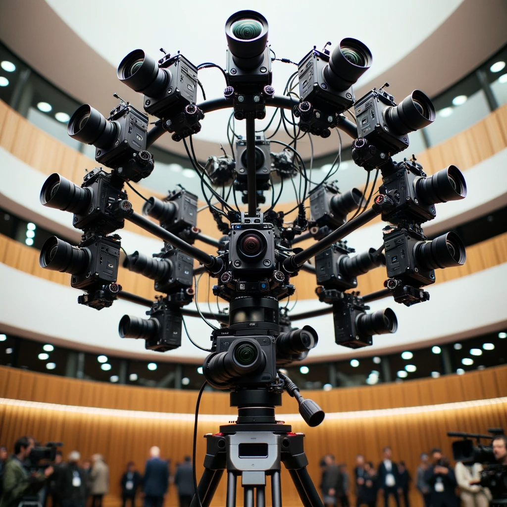

# COLMAP installation

## Installation using docker
### 1. Building the Image
There is  [docker file](https://github.com/colmap/colmap/blob/main/docker/Dockerfile) for this project that contains all dependencies and you build the image with :   


- get the OS version, the `$distribution` should gives you your OS version  `ubuntu22.04`: 

```
distribution=$(. /etc/os-release;echo $ID$VERSION_ID)
```

- add the package repositories:
```
curl -s -L https://nvidia.github.io/nvidia-docker/gpgkey | sudo apt-key add -
curl -s -L https://nvidia.github.io/nvidia-docker/$distribution/nvidia-docker.list | sudo tee /etc/apt/sources.list.d/nvidia-docker.list
```

- Install nvidia-container-toolkit
```
sudo apt-get update && sudo apt-get install -y nvidia-container-toolkit
sudo systemctl restart docker
```
- Check that it worked!

```
docker run --gpus all nvidia/cuda:<CUDA-version>-base nvidia-smi
```
For instance:

```
docker run --gpus all nvidia/cuda:10.2-base nvidia-smi
```


`docker build -t="colmap:latest" --build-arg CUDA_ARCHITECTURES=75 .`

`xhost +local:`
`docker run -v /home/$USER/:/home/$USER/ -v /tmp/.X11-unix:/tmp/.X11-unix --name colmap -e DISPLAY=$DISPLAY -e QT_X11_NO_MITSHM=1 --network=host --privileged -it colmap bash`


`docker build -t sfm .`

to quickly check your nvidia docker, run:

`docker run --gpus all nvidia/cuda:11.6.0-devel-ubuntu20.04 nvidia-smi`


### 2. Creating the container
Create a container where you mount your image dataset into your container: 

`docker run --gpus all --name <continer-name> -v <image-dataset-path-on-host>:<path-in-the-container> -it <docker-image-name>`

for instance:

`docker run --gpus all --name sfm_container -v /home/behnam/workspace/sfm:/sfm -it sfm`

### 3. Starting an existing container
If you have already created a container from the docker image, you can start it with:

`docker  start -i sfm_container`


Refs: [1](https://docs.nvidia.com/datacenter/cloud-native/container-toolkit/install-guide.html#docker), [2](https://github.com/colmap/colmap/blob/dev/docker/Dockerfile), [3](https://github.com/NVIDIA/nvidia-docker)


## Direct installation on your machine
### CUDA Installation

1. Verify You Have a CUDA-Capable GPU

`lspci | grep -i nvidia`

2. The kernel headers and development packages

`apt-get install linux-headers-$(uname -r)`

3. Download and install the CUDA from [here](https://developer.nvidia.com/cuda-downloads)


## CUDA settings
To see the current default version of installed CUDA:
```
sudo update-alternatives --display cuda
```
To change the default version pf CUDA:
```
sudo update-alternatives --config cuda
```
to see the version of the CUDA compiler:
```
 /usr/local/cuda/bin/nvcc --version
```

to set the preferred CUDA version and set the preferred executable for compiling CUDA language files:

```
CUDACXX=/usr/local/<cuda-version>/bin/nvcc
export PATH="/usr/local/<cuda-version>/bin:$PATH"
export LD_LIBRARY_PATH="/usr/local/<cuda-version>/lib64:$LD_LIBRARY_PATH"
```
for instance:
```
export PATH="/usr/local/cuda-11.8/bin:$PATH"
export LD_LIBRARY_PATH="/usr/local/cuda-11.8/lib64:$LD_LIBRARY_PATH"
```


## COLMAP Installation

Dependencies:
 
```
sudo apt-get install \
    git \
    cmake \
    ninja-build \
    build-essential \
    libboost-program-options-dev \
    libboost-filesystem-dev \
    libboost-graph-dev \
    libboost-system-dev \
    libboost-test-dev \
    libeigen3-dev \
    libflann-dev \
    libfreeimage-dev \
    libmetis-dev \
    libgoogle-glog-dev \
    libgflags-dev \
    libsqlite3-dev \
    libglew-dev \
    qtbase5-dev \
    libqt5opengl5-dev \
    libcgal-dev \
    libceres-dev
```

if you need to build `ceres-solver`, first install `abseil`:

```
git git@github.com:abseil/abseil-cpp.git
cd abseil-cpp
git checkout 20240722.0
cmake -S . -B build -DCMAKE_BUILD_TYPE=Release -DBUILD_SHARED_LIBS=ON -DCMAKE_INSTALL_PREFIX:PATH=~/usr -Dabsl_VERSION=20240722.0
cmake --build build/ --parallel
cmake --install build 

```
then make `ceres-solver`:


```
git clone git@github.com:ceres-solver/ceres-solver.git


export CUDA_HOME=/usr/local/cuda
export LD_LIBRARY_PATH=$LD_LIBRARY_PATH:/usr/local/cuda/lib64
export PATH=$PATH:$CUDA_HOME/bin

cmake -S . -B build -DCMAKE_BUILD_TYPE=Release -DBUILD_EXAMPLES=FALSE -DBUILD_TESTING=OFF  -Dabsl_DIR=~/usr/lib/cmake/absl/ -DCMAKE_INSTALL_PREFIX:PATH=~/usr

cmake --build build/ --parallel

cmake --install build 
```


Under **Ubuntu 22.04**, there is a problem when compiling with Ubuntu’s default CUDA package and GCC, and you must compile against GCC 10:


Set the compilers:

```
sudo apt-get install gcc-10 g++-10
export CC=/usr/bin/gcc-10
export CXX=/usr/bin/g++-10
export CUDAHOSTCXX=/usr/bin/g++-10
```

Download and build COLMAP

``` 
git clone https://github.com/colmap/colmap &&
cd colmap &&
git pull https://github.com/colmap/colmap.git && 
git fetch --tags &&
git checkout $(git describe --tags `git rev-list --tags --max-count=1`) &&
mkdir build &&
cd build &&
CUDA_ARCHITECTURES=75 &&
cmake .. -GNinja -DCMAKE_CUDA_ARCHITECTURES=$CUDA_ARCHITECTURES -DCMAKE_INSTALL_PREFIX=~/usr &&
ninja &&
ninja install && 
```

Now set the path so you can access the colmap:

```
export LD_LIBRARY_PATH=$LD_LIBRARY_PATH:/home/$USER/usr/lib/
export PATH=$PATH:/home/$USER/usr/bin
```


# Running COLMAP via Command-line Interface

create a project folder i.e. `south-building`. This directory must contain a folder `images` with all the images. If you need to resize your images run the following, it will resize your images `20%` and put them in the `_resized` directory:

`find . -maxdepth 1 -iname "*.jpg" | xargs -L1 -I{} convert -resize 20% "{}" _resized/"{}"`

First, set the path:

`DATASET_PATH=/sfm/image_dataset/south-building`

and create dense and sparse directories:

```
mkdir $DATASET_PATH/sparse
mkdir $DATASET_PATH/dense
```

## Feature Extraction
Now run the feature extractor:

```   
colmap feature_extractor  \
--database_path $DATASET_PATH/database.db  \
--image_path $DATASET_PATH/images  \
--ImageReader.single_camera true  \
--SiftExtraction.use_gpu 1 
```

If you have your camera parameter you specify them:

set your camera parameters:
```
CAM=fx,fy,cx,cy,k1,k2,k3,k4
```
Then 
```
colmap feature_extractor  \
--database_path $DATASET_PATH/database.db  \
--image_path $DATASET_PATH/images  \
--ImageReader.single_camera=true --ImageReader.camera_model=OPENCV_FISHEYE --ImageReader.camera_params=$CAM \ --SiftExtraction.use_gpu 1
```

[List of camera models in COLMAP](https://colmap.github.io/cameras.html)


To increase the number of matches, you should use the more discriminative DSP-SIFT features instead of plain SIFT and also estimate the affine feature shape using the options:
```
--SiftExtraction.estimate_affine_shape=true \
--SiftExtraction.domain_size_pooling=true\
```
Also, you should enable guided feature matching in the matching step (exhaustive_matcher, sequential_matcher, etc) using: `--SiftMatching.guided_matching=true`
so your extraction would be:


```
colmap feature_extractor  \
--database_path $DATASET_PATH/database.db  \
--image_path $DATASET_PATH/images  \
--ImageReader.single_camera=true --ImageReader.camera_model=OPENCV_FISHEYE --ImageReader.camera_params=$CAM \ --SiftExtraction.use_gpu 1 \
--SiftExtraction.estimate_affine_shape=true \
--SiftExtraction.domain_size_pooling=true
```

Warning: The GPU implementation of SIFT simply does not support estimating **affine shapes**. Thus, Colmap falls back to a **CPU** implementation of SIFT that supports this feature.

Refs: [1](https://colmap.github.io/faq.html#increase-number-of-matches-sparse-3d-points)

## Guided Matching


`SiftMatching.guided_matching` is an option used to enable or disable guided matching for feature matches.

Guided matching is used primarily in the context of epipolar geometry. Given an image pair and the essential matrix `E` that relates them, the epipolar constraint states that for any point in the first image, its corresponding match in the second image should lie on a specific line known as the epipolar line. This constraint can be derived from the essential matrix `E`.

Guided matching leverages this epipolar constraint to refine feature matches. Here's what happens when you enable `SiftMatching.guided_matching`:

1. Initial matches between two images are found based on the SIFT descriptors.
2. Using the matches, an essential matrix `E` is estimated.
3. With the estimated `E`, the epipolar lines in the second image for each feature in the first image are computed.
4. Matches that don't lie close to these epipolar lines are considered mismatches and are discarded.
5. The result is a refined set of matches that adhere better to the epipolar geometry.

Guided matching is especially useful in cases where there might be many false matches, as it uses the geometric relationship between the matched points to further refine and filter the matches.

If `SiftMatching.guided_matching` is set to `true`, guided matching will be applied; if set to `false`, it won't be applied.


## Feature Matching

### Exhaustive Matching   
Then run the matcher: 
```
colmap exhaustive_matcher \
   --database_path $DATASET_PATH/database.db \
   --SiftMatching.use_gpu 1
```
### Sequential Matching

If your images are in sequential order and consecutive frames have visual overlap, consecutively captured images can be matched against each other. This matching mode has built-in loop detection based on a vocabulary tree.
Every N-th image (`loop_detection_period`) is matched against its visually most similar images (`loop_detection_num_images`). Image file names must be ordered sequentially (e.g., `image0001.jpg, image0002.jpg`, etc.), and images are explicitly ordered according to their file names. Note that loop detection requires a pre-trained vocabulary tree, that can be downloaded from [Here](https://demuc.de/colmap/).

```
colmap sequential_matcher \
   --database_path $DATASET_PATH/database.db \
   --SequentialMatching.overlap=3 \
   --SequentialMatching.loop_detection=true \
   --SequentialMatching.loop_detection_period=2 \
   --SequentialMatching.loop_detection_num_images=50 \
   --SequentialMatching.vocab_tree_path="../vocab_tree/vocab_tree_flickr100K_words32K.bin" \
   --SiftMatching.use_gpu 1 --SiftMatching.gpu_index=-1  --SiftMatching.guided_matching=true  
```

Refs: [1](https://colmap.github.io/tutorial.html#feature-matching-and-geometric-verification)

### Hierarchical Mapper
`hierarchical_mapper`: Sparse 3D reconstruction / mapping of the dataset using hierarchical SfM after performing feature extraction and matching. This parallelizes the reconstruction process by partitioning the scene into overlapping submodels and then reconstructing each submodel independently. Finally, the overlapping submodels are merged into a single reconstruction. It is recommended to run a few rounds of point triangulation and bundle adjustment after this step.


## Sparse 3D Reconstruction

Then run the mapper:

```
colmap mapper \
    --database_path $DATASET_PATH/database.db \
    --image_path $DATASET_PATH/images \
    --output_path $DATASET_PATH/sparse
```

## Undistortion
Then run the image undistorter:

```
colmap image_undistorter \
    --image_path $DATASET_PATH/images \
    --input_path $DATASET_PATH/sparse/0 \
    --output_path $DATASET_PATH/dense \
    --output_type COLMAP \
    --max_image_size 2000
```

##  Dense 3D Reconstruction

Then run the match stereo(warning this will take a while):

```
colmap patch_match_stereo \
    --workspace_path $DATASET_PATH/dense \
    --workspace_format COLMAP \
    --PatchMatchStereo.geom_consistency true
```

## Fusion Into Point Cloud

Then run the stereo fusion:

```
colmap stereo_fusion \
    --workspace_path $DATASET_PATH/dense \
    --workspace_format COLMAP \
    --input_type geometric \
    --output_path $DATASET_PATH/dense/fused.ply
```

## Meshing of Fused Point Cloud

Now your point cloud is ready, you can create mesh file from that:

```
colmap poisson_mesher \
    --input_path $DATASET_PATH/dense/fused.ply \
    --output_path $DATASET_PATH/dense/meshed-poisson.ply
```

and optionally a delaunay mesh:

```
colmap delaunay_mesher \
    --input_path $DATASET_PATH/dense \
    --output_path $DATASET_PATH/dense/meshed-delaunay.ply    
```

Ref: [1](https://colmap.github.io/cli.html)

# Running COLMAP GUI

1. You need to run:

`docker run --gpus all --name sfm_container_gui -v /home/behnam/workspace/sfm:/sfm --env="DISPLAY" --env="QT_X11_NO_MITSHM=1" --volume="/tmp/.X11-unix:/tmp/.X11-unix:rw" -it sfm`


2. On the host run the following (every time you run your container):

`export containerId=$(docker ps -l -q)`

<code>  xhost +local: docker inspect --format='{{ .Config.Hostname }}' $containerId </code>

Refs: [1](https://github.com/jamesbrink/docker-opengl)

# Tips and Utility Tools

## 1. Reconstruct Sparse/Dense Model From Known Camera Poses


### Files and directory structure
You data should have the following structure: 

```
├── cameras.txt
├── images
│   ├── 00000.png
│   ├── 00001.png
│   ├── 00002.png
│   └── 00003.png
├── images.txt
└── points3D.txt
```

`cameras.txt`:

```
# Camera list with one line of data per camera:
#   CAMERA_ID, MODEL, WIDTH, HEIGHT, PARAMS[]
# Number of cameras: 3
1 SIMPLE_PINHOLE 3072 2304 2559.81 1536 1152
2 PINHOLE 3072 2304 2560.56 2560.56 1536 1152
3 SIMPLE_RADIAL 3072 2304 2559.69 1536 1152 -0.0218531
```

`images.txt`:

```
# Image list with two lines of data per image:
#   IMAGE_ID, QW, QX, QY, QZ, TX, TY, TZ, CAMERA_ID, NAME
#   POINTS2D[] as (X, Y, POINT3D_ID)
# Number of images: 2, mean observations per image: 2
1 0.695104 0.718385 -0.024566 0.012285 -0.046895 0.005253 -0.199664 1 00000.png

2 0.696445 0.717090 -0.023185 0.014441 -0.041213 0.001928 -0.134851 1 00001.png

3 0.697457 0.715925 -0.025383 0.018967 -0.054056 0.008579 -0.378221 1 00002.png

4 0.698777 0.714625 -0.023996 0.021129 -0.048184 0.004529 -0.313427 1 00003.png
```

`points3D.txt`: This file should be empty.


Refs: [1](https://colmap.github.io/faq.html#reconstruct-sparse-dense-model-from-known-camera-poses)


### Example KITTI dataset:

1. run the script [kitti_to_colmap_noise](../scripts/kitti/kitti_to_colmap_noise.py) and dump the output into `images.txt` file so


```
python kitti_to_colmap_noise.py > images.txt
```

### Setting up parameters

Then set the camera param:

```
CAM=707.0912,707.0912,601.8873,183.1104
```

set the project:
```
project_name=kitti_noisy
DATASET_PATH=/home/$USER/colmap_projects/$project_name
```

### Feature extraction

extract the features:
```
colmap feature_extractor  \
--database_path $DATASET_PATH/database.db  \
--image_path $DATASET_PATH/images  \
--ImageReader.single_camera=true --ImageReader.camera_model=PINHOLE --ImageReader.camera_params=$CAM \
--SiftExtraction.use_gpu 1 \
--SiftExtraction.estimate_affine_shape=true \
--SiftExtraction.domain_size_pooling=true
```

or 

```
colmap feature_extractor  \
--database_path $DATASET_PATH/database.db  \
--image_path $DATASET_PATH/images  \
--ImageReader.single_camera=true --ImageReader.camera_model=PINHOLE --ImageReader.camera_params=$CAM
```

### Matcher
run the matcher:

```
colmap sequential_matcher \
   --database_path $DATASET_PATH/database.db \
   --SequentialMatching.overlap=3 \
   --SequentialMatching.loop_detection=true \
   --SequentialMatching.loop_detection_period=2 \
   --SequentialMatching.loop_detection_num_images=50 \
   --SequentialMatching.vocab_tree_path="$DATASET_PATH/../vocab_tree/vocab_tree_flickr100K_words32K.bin" \
   --SiftMatching.use_gpu 1 --SiftMatching.gpu_index=-1  --SiftMatching.guided_matching=true 
```

create the following directory:

```
dense/sparse/model/0
dense/refined/model/0
```

### Triangulation
then run the 

```
colmap point_triangulator \
    --database_path $DATASET_PATH/database.db \
    --image_path $DATASET_PATH/images\
    --input_path $DATASET_PATH/sparse/model/0 \
    --output_path $DATASET_PATH/dense/sparse/model/0
```

Now run bundle adjuster to only optimize the extrinsic (camera position and orientations) and **NOT** intrinsic (camera parameter)


```
colmap bundle_adjuster  \
  --input_path $DATASET_PATH/dense/sparse/model/0 \
  --output_path $DATASET_PATH/dense/refined/model/0 \
  --BundleAdjustment.refine_focal_length  0 \
  --BundleAdjustment.refine_principal_point   0 \
  --BundleAdjustment.refine_extra_params  0 \
  --BundleAdjustment.refine_extrinsics  1
```  


## 2. Merging Disconnected Models

```
colmap model_merger \
    --input_path1 /path/to/sub-model1 \
    --input_path2 /path/to/sub-model2 \
    --output_path /path/to/merged-model
```


The two folders should contain the output of the reconstruction process, i.e., either the `cameras.bin, images.bin, points3D.bin `files or the `cameras.txt, images.txt, points3D.txt` files.


To improve the quality of the alignment between the two sub-models, it is recommended to run another global bundle adjustment after the merge: 

```
colmap bundle_adjuster \
    --input_path /path/to/merged-model \
    --output_path /path/to/refined-merged-model
```


## Merge two Colmap Databases

Merging two COLMAP databases can be useful when you have processed different subsets of a dataset separately and want to bring the results together into a single database. To merge two COLMAP databases, follow these steps:

1. **Backup Databases**: 
   
   Before making any changes, always backup your databases to prevent any unintended data loss.

2. **Use COLMAP's `database_merger` Tool**:

   COLMAP provides a tool named `database_merger` specifically for merging two databases.

   ```bash
   colmap database_merger \
       --database_path1 path/to/database1.db \
       --database_path2 path/to/database2.db \
       --output_path path/to/merged_database.db
   ```

   Replace `path/to/database1.db`, `path/to/database2.db`, and `path/to/merged_database.db` with your actual paths. 

   This command will merge the contents of `database1.db` and `database2.db` into `merged_database.db`.

3. **Inspect the Merged Database**:

   After merging, you should check the resulting database to ensure that the data has been merged correctly. You can use COLMAP's GUI to open the database and inspect its contents.

4. **Proceed with Reconstruction**:

   If everything looks good, you can continue with the reconstruction process using the merged database.

Note: Ensure that the two databases you are merging are compatible. They should ideally be created with the same version of COLMAP and should not have overlapping images or camera IDs. If there are conflicts between the two databases, the merging process might produce unexpected results.


  

## Extending COLMAP


## COLMAP and Visual Odometry

Refs: [1](https://github.com/colmap/colmap/issues/568)

## COLMAP Parameters
Refs: [1](https://github.com/mwtarnowski/colmap-parameters)


## Loop Closure
Colmap can add images in arbitrary order. Colmap prefers to use image pairs that are not pure forward motion for **initialization**. 

Try skipping frames, eg, use only a frame every 1 or 2 seconds. This should improve reduce drift for video data. You could also try to I crease the size of the local bundle adjustment window.  Otherwise, COLMAP probably detects the loops successfully but cannot optimize them as well as ORBSLAM, which is specifically optimized for the SLAM scenario. It also does pose graph optimization if I remember correctly, which is better in correcting for large drift than pure bundle adjustment used in COLMAP.

Refs: [1](https://github.com/colmap/colmap/issues/1521), [2](https://github.com/colmap/colmap/issues/254)


## Train the Vocabulary Tree
Refs: [1](https://github.com/colmap/colmap/issues/866)


## External Dense Reconstruction Libraries
If you do not have a CUDA-enabled GPU but some other GPU, you can use all COLMAP functionality except the dense reconstruction part. You can use external dense reconstruction software as an alternative. COLMAP exports to several other dense reconstruction libraries, .

- CMVS/PMVS [furukawa10]
- CMP-MVS [jancosek11]
- Line3D++ [hofer16].


Refs: [1](https://colmap.github.io/tutorial.html#dense-reconstruction)


## Improving Dense Reconstruction of Weakly Textured Surfaces

Refs: [1](https://colmap.github.io/faq.html#improving-dense-reconstruction-results-for-weakly-textured-surfaces)


## Speedup Dense Reconstruction


Refs: [1](https://colmap.github.io/faq.html#speedup-dense-reconstruction)


## Importing and Exporting

output type could be `{BIN, TXT, NVM, Bundler, VRML, PLY, R3D, CAM}`

```
colmap model_converter --input_path $DATASET_PATH/sparse/0 --output_path /home/$USER/ --output_type TXT
```
which will give you `points3D.txt`, `images.txt`, `cameras.txt`

The output could be used for [Instant-ngp: Instant neural graphics primitives](https://nvlabs.github.io/instant-ngp/)


## Instant-ngp

```
python3 /home/$USER/workspace/instant-ngp/scripts/colmap2nerf.py --text /home/$USER/<above-output> --images /home/$USER/<images>
```


## Register/Localize New Images Into an Existing Reconstruction

If you have an existing reconstruction of images and want to register/localize new images within this reconstruction, you can follow these steps:
create an image list text file contains a list of images to get extracted and matched, specified as one image file name per line. 

```
colmap feature_extractor \
    --database_path $PROJECT_PATH/database.db \
    --image_path $PROJECT_PATH/images \
    --image_list_path /path/to/image-list.txt

colmap vocab_tree_matcher \
    --database_path $PROJECT_PATH/database.db \
    --VocabTreeMatching.vocab_tree_path /path/to/vocab-tree.bin \
    --VocabTreeMatching.match_list_path /path/to/image-list.txt

colmap image_registrator \
    --database_path $PROJECT_PATH/database.db \
    --input_path /path/to/existing-model \
    --output_path /path/to/model-with-new-images

colmap bundle_adjuster \
    --input_path /path/to/model-with-new-images \
    --output_path /path/to/model-with-new-images
```


If you need a more accurate image registration with triangulation, then you should restart or continue the reconstruction process rather than just registering the images to the model. Instead of running the `image_registrator`, you should run the mapper to continue the reconstruction process from the existing model:

```
colmap mapper \
    --database_path $PROJECT_PATH/database.db \
    --image_path $PROJECT_PATH/images \
    --input_path /path/to/existing-model \
    --output_path /path/to/model-with-new-images
```
    
Or, alternatively, you can start the reconstruction from scratch:

```
colmap mapper \
    --database_path $PROJECT_PATH/database.db \
    --image_path $PROJECT_PATH/images \
    --output_path /path/to/model-with-new-images
```

Note that dense reconstruction must be re-run from scratch after running the `mapper` or the `bundle_adjuster`, as the coordinate frame of the model can change during these steps.    


Refs: [1](https://colmap.github.io/faq.html#register-localize-new-images-into-an-existing-reconstruction)


## Manhattan World Alignment

Insert this after the mapper:
```
colmap model_orientation_aligner \
    --input_images $DATASET_PATH/images  \
    --input_path $DATASET_PATH/images \
    --output_path $DATASET_PATH/sparse_aligned
```
and then use the "sparse_aligned" as the input for subsequent steps.


Manhattan world alignment is a computer vision concept used in scene understanding and 3D reconstruction. It is based on the assumption that the world is composed of a set of dominant, orthogonal (at right angles to each other) surfaces, much like the layout of buildings and streets in Manhattan, New York City. This assumption simplifies the understanding and reconstruction of scenes, making it easier for computer algorithms to interpret and analyze the environment.

In a Manhattan world, the three main orthogonal directions are typically aligned with the three axes of a Cartesian coordinate system:

- X-axis: Horizontal direction (left-right).
- Y-axis: Vertical direction (up-down).
- Z-axis: Depth direction (front-back).


In this world, the surfaces are assumed to be planar (flat), and objects are placed parallel or perpendicular to each other, forming right angles. Due to this assumption, scenes can be described more easily, and object orientations and locations can be estimated with greater accuracy.

Manhattan world alignment is often used in computer vision tasks like:

1. Vanishing point detection: Detecting the points where parallel lines in a scene converge (vanish) due to perspective projection. In a Manhattan world, the vanishing points often align with the X, Y, and Z axes.

2. 3D scene reconstruction: Inferring the 3D structure of a scene from 2D images. Assuming a Manhattan world simplifies the process of reconstructing 3D geometry from 2D images.

3. Object detection and orientation estimation: Understanding the layout and orientation of objects in a scene, assuming they are aligned with the dominant surfaces.

By leveraging the Manhattan world assumption, computer vision algorithms can efficiently reason about scene layout, estimate camera poses, and make accurate predictions about the positions and orientations of objects in a 3D environment. However, it's essential to note that not all real-world scenes adhere strictly to the Manhattan world assumption, especially in outdoor environments or complex indoor scenes. Nevertheless, the concept provides a useful starting point for many computer vision applications, and more advanced techniques can be applied to handle non-Manhattan scenes.

Refs: [1](https://colmap.github.io/faq.html#manhattan-world-alignment), [2](https://github.com/colmap/colmap/issues/1743), [3](https://grail.cs.washington.edu/projects/manhattan/manhattan.pdf)


## Multiple View Triangulation

`feature_importer` and `matches_importer`

Refs: [1](https://robotics.stackexchange.com/questions/16132/multiple-view-triangulation-method-used-by-colmap), [2](https://github.com/colmap/colmap/issues/688)


## Camera Models
- SIMPLE_PINHOLE: `f,cx,cy`
- PINHOLE: `fx,fy,cx,cy`
- SIMPLE_RADIAL: `f,cx,cy,k`
- SIMPLE_RADIAL_FISHEYE: `f,cx,cy,k`
- RADIAL: `f,cx,cy,k1,k2`
- RADIAL_FISHEYE: `f,cx,cy,k1,k2`
- OPENCV: `fx,fy,cx,cy,k1,k2,p1,p2`
- OPENCV_FISHEYE:`fx,fy,cx,cy,k1,k2,k3` 
- FULL_OPENCV: `fx,fy,cx,cy,k1,k2,p1,p2,k3,k4,k5,k6` 
- FOV:`fx,fy,cx,cy,omega`
- THIN_PRISM_FISHEYE: `fx,fy,cx,cy,k1,k2,p1,p2,k3,k4,sx1,sy1`

Refs: [1](https://colmap.github.io/cameras.html)


## Rig bundle Adjuster
What the rig bundle adjuster does is it takes a 3D reconstruction as input and performs some form of constrained bundle adjustment. The constraint here comes from using a multi-camera rig. During reconstruction, Colmap does not enforce relative pose constraints between images taken at the same point in time by the different cameras in the multi-camera rig. This is done as a post-processing step by the rig bundle adjuster.
To this end, you first need to define the multi-camera rig (as explained in the documentation starting in the above code snippet).

Note that the purpose of the rig bundle adjuster is not pose graph optimization. Rather it tries to ensure a rigid movement of the multi-camera rig, i.e., the relative pose between two cameras in the rig should stay the same over all snapshots (images taken by the multi-camera rig at the same point in time).
This is not the same as pose graph optimization, where relative poses between images are used as measurements.

Refs: [1](https://github.com/colmap/colmap/issues/891)




An example configuration of a single camera rig:

```
 [
   {
     "ref_camera_id": 1,
     "cameras":
     [
       {
           "camera_id": 1,
           "image_prefix": "left1_image"
           "rel_tvec": [0, 0, 0],
           "rel_qvec": [1, 0, 0, 0]
       },
       {
           "camera_id": 2,
           "image_prefix": "left2_image"
           "rel_tvec": [0, 0, 0],
           "rel_qvec": [0, 1, 0, 0]
       },
       {
           "camera_id": 3,
           "image_prefix": "right1_image"
           "rel_tvec": [0, 0, 0],
           "rel_qvec": [0, 0, 1, 0]
       },
       {
           "camera_id": 4,
           "image_prefix": "right2_image"
           "rel_tvec": [0, 0, 0],
           "rel_qvec": [0, 0, 0, 1]
       }
     ]
   }
 ]

 The "camera_id" and "image_prefix" fields are required, whereas the
 "rel_tvec" and "rel_qvec" fields optionally specify the relative
 extrinsics of the camera rig in the form of a translation vector and a
 rotation quaternion. The relative extrinsics rel_qvec and rel_tvec transform
 coordinates from rig to camera coordinate space. If the relative extrinsics
 are not provided then they are automatically inferred from the
 reconstruction.

 This file specifies the configuration for a single camera rig and that you
 could potentially define multiple camera rigs. The rig is composed of 4
 cameras: all images of the first camera must have "left1_image" as a name
 prefix, e.g., "left1_image_frame000.png" or "left1_image/frame000.png".
 Images with the same suffix ("_frame000.png" and "/frame000.png") are
 assigned to the same snapshot, i.e., they are assumed to be captured at the
 same time. Only snapshots with the reference image registered will be added
 to the bundle adjustment problem. The remaining images will be added with
 independent poses to the bundle adjustment problem. The above configuration
 could have the following input image file structure:

    /path/to/images/...
        left1_image/...
            frame000.png
            frame001.png
            frame002.png
            ...
        left2_image/...
            frame000.png
            frame001.png
            frame002.png
            ...
        right1_image/...
            frame000.png
            frame001.png
            frame002.png
            ...
        right2_image/...
            frame000.png
            frame001.png
            frame002.png
            ...
```

you can call `rig_bundle_adjuster` to run the bundle adjuster for a known rig mode:

```bash
colmap rig_bundle_adjuster --input_path $DATASET_PATH/sparse/0 --output_path $DATASET_PATH/sparse/rig --rig_config_path $DATASET_PATH/rig_config.json
```

Example in the [documentation](https://github.com/colmap/colmap/blob/main/src/colmap/exe/sfm.cc)  

Example of parameters in the  [test file](https://github.com/colmap/colmap/blob/main/src/colmap/scene/camera_rig_test.cc)  


Refs: [1](https://github.com/colmap/colmap/issues/1624), [2](https://pdfs.semanticscholar.org/b01d/3c3cd7b43e58a344c8ea40d08aa87d63b13f.pdf)


## Colmap SLAM


Paper: [COLMAP-SLAM: A FRAMEWORK FOR VISUAL ODOMETRY](https://isprs-archives.copernicus.org/articles/XLVIII-1-W1-2023/317/2023/isprs-archives-XLVIII-1-W1-2023-317-2023.pdf)  
[code](https://github.com/3DOM-FBK/COLMAP_SLAM)

