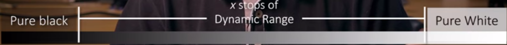
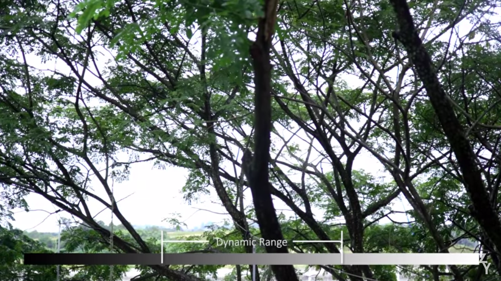
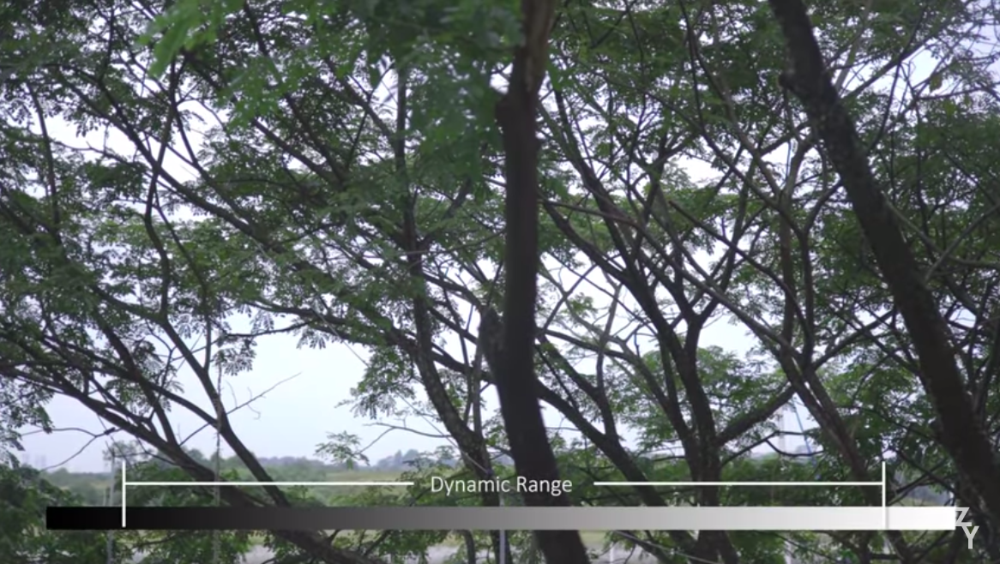

# Dynamic Range

Dynamic range measures the range between the maximum and minimum brightness values of an image. It is the difference between the whitest whites and the blackest blacks that a camera sensor can capture.

whatever falls below the range will be saved as pure black and whatever is above the upper part is saved as pure white.

[image courtesy](https://www.youtube.com/watch?v=SrXwiPH-fCg)
