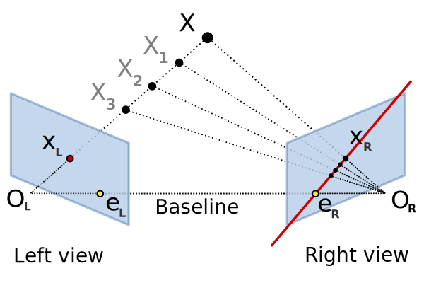
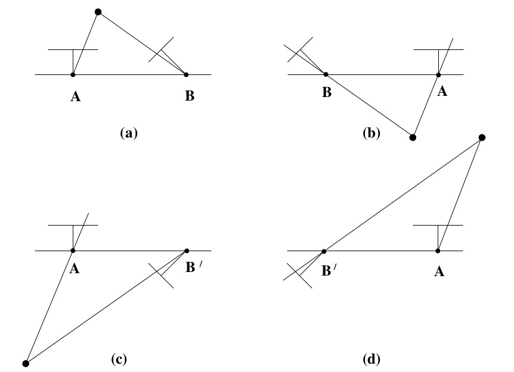

# Essential Matrix

 Essential matrix  is a  that relates optical center of cameras

We can relate any two frame by a rotation matrix and a translation vector:
 
 

 
 

We cross product both side by :
 
 

 
 
For any vector cross product of with itself is zero:
 
 

 
 

We dot product both side by :
 
 

 
 
on the lhs,    is perpendicular to 
so the result is zero vector, also we can write any cross product as skew-symmetric matrix multiplication, therefore:
 
 

 
 

 
 

# 8-point Algorithm

## Minimal solution
8 point correspondences are needed

The 8-point algorithm assumes that the entries of E are all independent
(which is not true since, for the calibrated case, they depend on 5 parameters (R and T))

The solution of the 8-point algorithm is degenerate when the 3D points are coplanar.
 Conversely, the 5-point algorithm works also for coplanar points

## Over-determined solution
n > 8 points 

                                                              
# 5-point Algorithm

The 5-point algorithm uses the epipolar constraint considering the dependencies among all entries.

Refs: [1](https://en.wikipedia.org/wiki/Essential_matrix)

# Decompose Essential Matrix
4 possible solutions of R and T"

There exists only one solution where points are in front of both cameras.
(For detail please read chapter 9.6.2 Extraction of cameras from the essential matrix, Multiple View Geometry in Computer Vision (Second Edition))

Refs: [1](https://docs.opencv.org/4.x/d9/d0c/group__calib3d.html#ga54a2f5b3f8aeaf6c76d4a31dece85d5d)

<!---
@incollection{grandstrand:2004,
  author      = "Ove Grandstrand",
  title       = "Innovation and Intellectual Property Rights",
  editor      = "Jan Fagerberg and David C. Mowery and Richard R. Nelson",
  booktitle   = "The Oxford Handbook of Innovation",
  publisher   = "Oxford University Press",
  address     = "Oxford",
  year        = 2004,
  pages       = "266-290",
  chapter     = 10,
}
-->

# Properties of the essential matrix

 
 

where `S` is skew-symmetric matrix.

 
 

 
 

It is possible to bring every skew-symmetric matrix to a block diagonal form by a special orthogonal transformation:

 
 

 
 

where  is a **block-diagonal** matrix

 
 

we can write it as:

 
 

A 3×3 matrix is an essential matrix if and only if two of its singular values are equal, and the third is zero.

Suppose that the SVD of E is

There are two possible factorizations E=SR

The four solutions are:

 
point X will be in front of both cameras in one of these four solutions only. Thus, testing
with a single point to determine if it is in front of both cameras is sufficient to decide
between the four different solutions for the camera matrix.

 
 

The essential matrix is the specialization of the fundamental matrix to the case of normalized image coordinates
