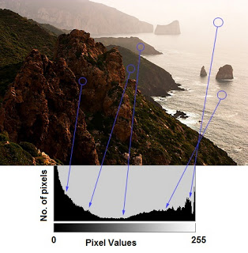
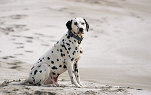
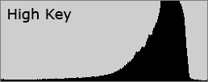
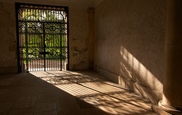
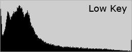
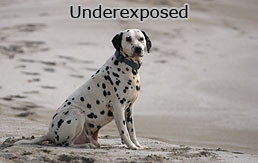
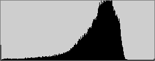
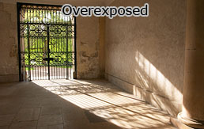
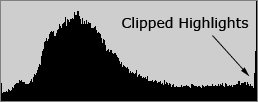
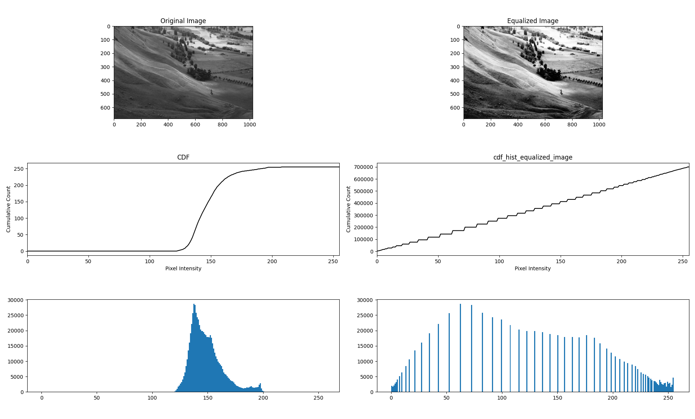

# Image contrast 


Image contrast refers to the difference in luminance or color that makes objects in an image distinguishable. In simpler terms, it's the difference between the lightest and darkest parts of an image. High contrast images have a larger difference between the darkest and lightest parts, whereas low contrast images have a smaller difference.


**Luminance Contrast:** This refers to the difference in brightness levels. In a black and white image, high contrast means very dark blacks and very bright whites. Low contrast in such an image might appear more grayish, with the darks not being very dark and the whites not being very bright.

**Color Contrast:** In color images, contrast can also refer to the difference in colors. For example, a red object against a green background has a high color contrast.

**Too High:** If the contrast is too high, you can lose details. Bright areas might become overexposed, and dark areas underexposed.

**Too Low:** A very low contrast can make the image look washed out and details can become muddled.




# High and Low Key Images

**High Key Images:**  High key images predominantly consist of light tones and whites, with very few mid-tones and shadows. Dark shadows, if present, are minimal.



<br/>



[image courtesy](https://www.cambridgeincolour.com/tutorials/histograms1.htm)


**Low Key Images:** Low key images are characterized by their dominance of dark tones and shadows. While they do have highlights, they are used sparingly to create dramatic contrast.



<br/>



[image courtesy](https://www.cambridgeincolour.com/tutorials/histograms1.htm)


Most of the cameras try to place the average brightness the midtones. For high and low key photos, photographers often need to change the exposure themselves instead of relying on the camera's automatic settings.

## Underexposed


<br/>

<br/>



<br/>

## Overexposed


<br/>

<br/>



# Histogram
## Histogram Calculation in OpenCV
```python
image = cv.imread(path_base+image_path,  cv.IMREAD_GRAYSCALE)

images = [image]
# For color image, you can pass [0], [1] or [2] 
channels = [0]
mask = None
histSize = [256]
ranges = [0, 256]

hist = cv.calcHist(images, channels, mask, histSize, ranges)
```

## Histogram Calculation in Numpy

```python
hist,bins = np.histogram(image.ravel(),256,[0,256])
```

Displaying histogram:
```python
plt.hist(image.ravel(), 256, [0, 256])
plt.show()
```
or 

```python
hist = cv.calcHist(images, channels, mask, histSize, ranges)
plt.plot(hist)
```


# Image Normalization
It aims to adjust the pixel values of an image to fit a standard scale, 

The following are some methods used.

## Rescaling: 
The linear normalization of a gray-scale digital image. One of the most common normalization methods is to rescale the pixel values to the range `[0,1]` or `[0,255]`. 

<!-- 

-->


## Standardization (Z-score Normalization)
Adjust the data to have a mean of 0 and a standard deviation of 1. This involves subtracting the mean of the pixel values from each pixel and then dividing by the standard deviation.


## Contrast Stretching

linearly rescaling the intensity levels to span the entire possible range. For example, in an 8-bit grayscale image, the intent is to stretch the current range of pixel values so that they span from 0 to 255.

**Method:** Identify the smallest (minimum) and largest (maximum) pixel values in the original image.
Linearly remap the original range [min, max] to the desired range, typically [0, 255] for an 8-bit image.

**Usage:** Particularly useful for images that have pixel values in a limited range due to issues like underexposure or overexposure. By stretching this range, the contrast of the image is improved.


The problem with this is that a single outlying pixel with either a very high or very low value can severely affect the value of `Min` or `Max` and this could lead to very unrepresentative scaling. Therefore a more robust approach is to first take a histogram of the image, and then select `Min` and `Max` at, say, the `5th` and `95th` percentile in the histogram (that is, 5% of the pixel in the histogram will have values lower than `Min`, and 5% of the pixels will have values higher than `Max`). This prevents outliers affecting the scaling so much.

Another common technique for dealing with outliers is to use the intensity histogram to find the most popular intensity level in an image (i.e. the histogram peak) and then define a cutoff fraction which is the minimum fraction of this peak magnitude below which data will be ignored. The intensity histogram is then scanned upward from 0 until the first intensity value with contents above the cutoff fraction. This defines `Min`. Similarly, the intensity histogram is then scanned downward from 255 until the first intensity value with contents above the cutoff fraction. This defines `Max`.


Refs [1](https://homepages.inf.ed.ac.uk/rbf/HIPR2/stretch.htm)


# Histogram Matching: 
Creating new image which has new distribution function (pdf)

# Histogram Normalization (Histogram Equalization)

Creating new image which has new uniform distribution. The primary idea behind **HE** is to adjust the intensity values of an image such that they're uniformly distributed across the entire range. **HE** works well for images where the subject and background are both underexposed or overexposed. But for images with varying brightness levels, applying HE can over-amplify the contrast in some regions, making details hard to discern.


**Method:** 
- Calculate the histogram of the image (a representation of the frequency of each intensity level).
- Determine the cumulative distribution function (CDF) of the histogram.
- Map the original pixel values to new values based on the CDF, effectively "flattening" the histogram.

**Key Points:**

- Non-Linear Transformation: Unlike some other contrast adjustment methods, histogram equalization involves a non-linear transformation based on the image's histogram.

- Enhanced Contrast: The primary benefit of histogram equalization is the enhancement of contrast in areas of the image with closely packed pixel intensities.

- Potential Artifacts: It's worth noting that histogram equalization can sometimes introduce noise or artifacts, especially in areas where the original image had very low contrast. Some variations of histogram equalization, like adaptive histogram equalization, have been developed to mitigate these potential issues.




Refs: [1](https://automaticaddison.com/difference-between-histogram-equalization-and-histogram-matching/)

# Adaptive Histogram Equalization (AHE):
To counter the issues of standard HE, AHE was introduced.
Instead of applying HE on the whole image, AHE divides the image into smaller, non-overlapping regions or tiles. HE is then applied to each of these small tiles.
This approach ensures that the equalization is adaptive and local, taking into consideration only the data in that tile. Thus, it can bring out details in regions with different brightness levels.
However, AHE has a drawback: If there's noise in the image, it can get amplified in the tiles, since noise can produce local intensity peaks.
Contrast Limited Adaptive Histogram Equalization (CLAHE):

# Contrast Limited Adaptive Histogram Equalization (CLAHE) 
Contrast Limited Adaptive Histogram Equalization (CLAHE) is an advanced method for improving the contrast of images. It's an extension of the standard histogram equalization (HE) method, which aims to enhance image contrast by redistributing the intensities of pixels. Here's a step-by-step breakdown of CLAHE:

1. Histogram Equalization (HE):
2. Adaptive Histogram Equalization (AHE):

CLAHE is an improvement over AHE.
The main difference is that in CLAHE, the histogram equalization is applied with a contrast limit. If any histogram bin is above this specified limit, the excess is clipped off and distributed among other bins.
This contrast limiting reduces the amplification of noise in the image.
After the contrast-limiting step, the neighboring tiles are combined using bilinear interpolation to remove any artificially induced boundaries, making the enhancement smooth.


# Gamma Correction

the formula for normalization sometime is written as:
new_x=a+ (b-a)*[(x-A)/(B-A)]^Gamma

because always 
0< (x-A)/(B-A) < 1 
so if Gamma is bigger than one then the result became smaller and if Gamma if smaller than 1 it became bigger

Refs: <a href="https://en.wikipedia.org/wiki/Gamma_correction#Methods_to_perform_display_gamma_correction_in_computing">[1]</a>


