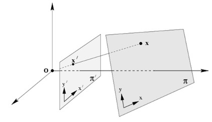
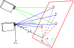
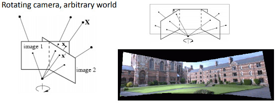

# 1. Homography
Any two images of the same planar surface in space are related by a homography. 
The planar homography relates the transformation between two planes (up to a scale factor):


The homography matrix is a `3x3` matrix with 8 DoF as it is estimated up to a scale. It is generally normalized:
 
 
 
 
 
 

Refs: [1](https://www.cse.psu.edu/~rtc12/CSE486/lecture16.pdf), [2](https://docs.opencv.org/4.x/d9/dab/tutorial_homography.html)

# 2. Different Kinds of Transformation Related By Homography 
The transformations shown in the followings instances are all related to transformations between two planes.


## 2.1 Planar Surface And The Image Plane





## 2.2 Planar Surface Viewed By Two Cameras


   


## 2.3 Rotating Camera Around Its Axis of Projection, 

A rotating camera around its axis of projection, equivalent to consider that the points are on a plane at infinity (image taken from



# 3. Calculating Homography Matrix
For any point in the world the projection of the point on the camera plan would be:


<br/>
<br/>

now if we put world reference frame on the plane such that X and Y axis lays on the plane:


so all point the `Z` will be zero: 


<br/>
<br/>


<br/>
<br/>


<br/>
<br/>


<br/>
<br/>


<br/>
<br/>


<br/>
<br/>


<br/>
<br/>

or:

<br/>
<br/>


<br/>
<br/>

if we write the upper equation for 4 points and rewrite them we would get the following linear equation to solve:

<br/>
<br/>


<br/>
<br/>
<br/>


Singular-value Decomposition (SVD) of any given matrix 

<br/>
<br/>
<br/>


 is the last column of 


# OpenCV API

To find homography Matrix from 4 Corresponding Points:


```cpp
cv::Mat homographyMatrix= cv::getPerspectiveTransform(point_on_plane1,point_on_plane2);
cv::Mat H = cv::findHomography(  point_on_plane1,point_on_plane2,0 );

```


If you need to perform the Homography matrix transformation on points:
```cpp
cv::perspectiveTransform 
```

If you want to transform an image using perspective transformation, use:


```cpp
cv::warpPerspective
```

The function `cv::warpPerspective` transforms the source image using the specified matrix:


<br/>
<br/>

[Apply homography on image](../src/apply_homography_on_image.cpp), 
<br/>
[Finding homography matrix from 4 corresponding points](../src/finding_homography_matrix_4_corresponding_points.cpp)
<br/>
[Finding homography Matrix between two images using keypoints and RANSAC](../src/finding_homography_using_keypoints_RANSAC.cpp)


# Decompose Homography Matrix
Refs: [1](https://docs.opencv.org/4.x/d9/d0c/group__calib3d.html#ga7f60bdff78833d1e3fd6d9d0fd538d92)


