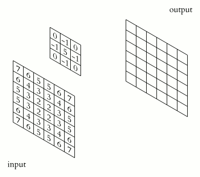

# Image Filtering and Convolution

Image filtering replaces each pixel with a function of its neighborhood. For
*linear* filters that function is a weighted sum defined by a small **kernel**
(also called a mask or window), and the operation that slides the kernel over
the image is either **convolution** or **correlation**.



## Convolution vs. Correlation

Given an image $I$ and a kernel $K$, **cross-correlation** is

$$
(I \star K)(x, y) = \sum_{i=-a}^{a} \sum_{j=-b}^{b} K(i, j)\, I(x + i, y + j)
$$

and **convolution** flips the kernel in both axes before summing:

$$
(I * K)(x, y) = \sum_{i=-a}^{a} \sum_{j=-b}^{b} K(i, j)\, I(x - i, y - j)
$$

So convolution is correlation with a $180^\circ$-rotated kernel. The two agree
whenever the kernel is symmetric (box, Gaussian, Laplacian), and differ for
asymmetric ones (Sobel, Scharr, arbitrary masks).

> **OpenCV gotcha:** `cv::filter2D` computes **correlation**, not true
> convolution. If you need mathematically correct convolution, flip the kernel
> yourself first (`cv::flip(kernel, kernel, -1)`), then call `filter2D`.

## Anchor Point and Border Handling

The **anchor** is the kernel position that lands on the output pixel; by
default it is the kernel center (`Point(-1, -1)`). For a $k \times k$ kernel
this requires $\lfloor k/2 \rfloor$ pixels of context on every side, so $k$ is
almost always odd.

At the image edges those neighbors fall outside the image and must be
synthesized. OpenCV exposes this through the `borderType` argument
(`cv::copyMakeBorder` uses the same modes). With `abcdefgh` as an image row and
`|` as the border:

| Mode | Extrapolation | Result near `|abc...` |
| --- | --- | --- |
| `BORDER_CONSTANT` | pad with a fixed value $v$ | `vvv|abcdefgh` |
| `BORDER_REPLICATE` | repeat the edge pixel | `aaa|abcdefgh` |
| `BORDER_REFLECT` | mirror including the edge | `cba|abcdefgh` |
| `BORDER_REFLECT_101` | mirror excluding the edge (default) | `dcb|abcdefgh` |
| `BORDER_WRAP` | wrap around (periodic) | `fgh|abcdefgh` |

`BORDER_REFLECT_101` (a.k.a. `BORDER_DEFAULT`) is the default for most filtering
functions because it avoids duplicating the edge pixel and introduces no bias.

## Linear Filters

### Box / Average Blur

The box filter averages a $k \times k$ neighborhood. Its normalized kernel is

$$
K = \frac{1}{k_w \, k_h}
\begin{bmatrix} 1 & \cdots & 1 \\ \vdots & \ddots & \vdots \\ 1 & \cdots & 1 \end{bmatrix}
$$

Use `cv::blur(src, dst, Size(kw, kh))` (normalized) or `cv::boxFilter(...)` for
the unnormalized variant. It is cheap but rings and does not preserve edges.

### Gaussian Blur

A Gaussian weights neighbors by distance, giving smoother, artifact-free
blurring. The 2D isotropic kernel is

$$
G(x, y) = \frac{1}{2\pi\sigma^2}\, e^{-\frac{x^2 + y^2}{2\sigma^2}}
$$

sampled on the kernel grid and normalized so the weights sum to 1. Larger
$\sigma$ means more blur; if $\sigma$ is passed as 0, OpenCV derives it from the
kernel size.

```cpp
cv::GaussianBlur(src, dst, cv::Size(5, 5), /*sigmaX=*/1.5);
```

**Separability.** The 2D Gaussian factors into two 1D Gaussians:

$$
G(x, y) = \underbrace{\frac{1}{\sqrt{2\pi}\,\sigma} e^{-\frac{x^2}{2\sigma^2}}}_{g(x)}
        \cdot
          \underbrace{\frac{1}{\sqrt{2\pi}\,\sigma} e^{-\frac{y^2}{2\sigma^2}}}_{g(y)}
$$

So a 2D convolution can be done as a horizontal 1D pass followed by a vertical
1D pass. For a $k \times k$ kernel this drops the cost per pixel from
$O(k^2)$ multiply-adds to $O(2k)$. OpenCV exploits this automatically; you can
also build the 1D kernel with `cv::getGaussianKernel` and apply it with
`cv::sepFilter2D`. Box and Sobel kernels are separable too.

## Derivative Filters

Derivatives respond to intensity changes (edges). Because differentiation
amplifies noise, these kernels combine a difference with light smoothing.

### Sobel

Sobel approximates $\partial I / \partial x$ and $\partial I / \partial y$ with a
$3 \times 3$ smoothing-plus-difference kernel:

$$
G_x = \begin{bmatrix} -1 & 0 & 1 \\ -2 & 0 & 2 \\ -1 & 0 & 1 \end{bmatrix}
\qquad
G_y = \begin{bmatrix} -1 & -2 & -1 \\ 0 & 0 & 0 \\ 1 & 2 & 1 \end{bmatrix}
$$

Gradient magnitude and orientation are
$\lVert \nabla I \rVert = \sqrt{G_x^2 + G_y^2}$ and
$\theta = \operatorname{atan2}(G_y, G_x)$. Compute an output that can hold
negatives (`CV_16S` / `CV_64F`), not `CV_8U`.

```cpp
cv::Mat gx, gy;
cv::Sobel(src, gx, CV_64F, /*dx=*/1, /*dy=*/0, /*ksize=*/3);
cv::Sobel(src, gy, CV_64F, /*dx=*/0, /*dy=*/1, /*ksize=*/3);
cv::Mat mag; cv::magnitude(gx, gy, mag);
```

### Scharr

For `ksize = 3`, Sobel's rotational symmetry is poor; **Scharr** is a
$3 \times 3$ kernel with a better-optimized weighting:

$$
S_x = \begin{bmatrix} -3 & 0 & 3 \\ -10 & 0 & 10 \\ -3 & 0 & 3 \end{bmatrix}
$$

Call `cv::Scharr(src, dst, CV_64F, 1, 0)` (or `cv::Sobel(..., ksize=cv::FILTER_SCHARR)`).

### Laplacian

The Laplacian is the sum of second derivatives, an isotropic edge/blob
operator:

$$
\nabla^2 I = \frac{\partial^2 I}{\partial x^2} + \frac{\partial^2 I}{\partial y^2},
\qquad
K = \begin{bmatrix} 0 & 1 & 0 \\ 1 & -4 & 1 \\ 0 & 1 & 0 \end{bmatrix}
$$

`cv::Laplacian(src, dst, CV_64F, ksize)`. Since it is noise-sensitive, blur
first; the composite is the Laplacian-of-Gaussian (LoG). The variance of the
Laplacian response is a common focus/blur measure.

## Sharpening (Unsharp Mask)

Sharpening boosts high frequencies. The **unsharp mask** subtracts a blurred
copy from the original and adds the difference back:

$$
I_{\text{sharp}} = I + \lambda\,(I - G_\sigma * I)
$$

where $G_\sigma * I$ is a Gaussian-blurred version and $\lambda > 0$ controls
strength. Equivalently, a single sharpening kernel (for $\lambda = 1$ with a
box blur) is:

$$
K = \begin{bmatrix} 0 & -1 & 0 \\ -1 & 5 & -1 \\ 0 & -1 & 0 \end{bmatrix}
$$

```cpp
cv::Mat blurred, sharp;
cv::GaussianBlur(src, blurred, cv::Size(0, 0), 3);
cv::addWeighted(src, 1.0 + lambda, blurred, -lambda, 0, sharp);
```

## Non-linear Filters

Weighted sums blur across edges. Non-linear filters avoid this.

- **Median blur** — replaces each pixel with the median of its window. It is
  excellent for salt-and-pepper noise and preserves edges because the median is
  an actual neighboring value, not an average. `cv::medianBlur(src, dst, ksize)`
  with odd `ksize`.

- **Bilateral filter** — a Gaussian in *space* multiplied by a Gaussian in
  *intensity*, so pixels that are far apart in value get little weight. This
  smooths flat regions while keeping edges sharp:

  $$
  I'(x) = \frac{1}{W}\sum_{x_i \in \Omega}
          I(x_i)\, G_{\sigma_s}(\lVert x - x_i \rVert)\,
                   G_{\sigma_r}(\lvert I(x) - I(x_i) \rvert)
  $$

  `cv::bilateralFilter(src, dst, d, sigmaColor, sigmaSpace)`. It is slow; use it
  for edge-preserving denoising or cartoon/stylization effects.

## OpenCV Snippets

### C++

```cpp
#include <opencv2/opencv.hpp>

cv::Mat src = cv::imread("in.png", cv::IMREAD_GRAYSCALE), dst;

// Custom kernel via correlation (filter2D). Flip for true convolution.
cv::Mat kernel = (cv::Mat_<float>(3, 3) <<
    0, -1,  0,
   -1,  5, -1,
    0, -1,  0);
cv::filter2D(src, dst, /*ddepth=*/-1, kernel, cv::Point(-1, -1),
             /*delta=*/0, cv::BORDER_DEFAULT);

// Gaussian blur and Sobel gradient
cv::Mat blurred, gx;
cv::GaussianBlur(src, blurred, cv::Size(5, 5), 1.5);
cv::Sobel(blurred, gx, CV_64F, 1, 0, 3);
```

### Python

```python
import cv2
import numpy as np

src = cv2.imread("in.png", cv2.IMREAD_GRAYSCALE)

kernel = np.array([[0, -1, 0],
                   [-1, 5, -1],
                   [0, -1, 0]], dtype=np.float32)
dst = cv2.filter2D(src, ddepth=-1, kernel=kernel,
                   borderType=cv2.BORDER_DEFAULT)

blurred = cv2.GaussianBlur(src, (5, 5), sigmaX=1.5)
gx = cv2.Sobel(blurred, cv2.CV_64F, 1, 0, ksize=3)
gy = cv2.Sobel(blurred, cv2.CV_64F, 0, 1, ksize=3)
mag = cv2.magnitude(gx, gy)
```

Refs:
- [OpenCV: Image Filtering module](https://docs.opencv.org/4.x/d4/d86/group__imgproc__filter.html)
- [OpenCV tutorial: Making your own linear filters (`filter2D`)](https://docs.opencv.org/4.x/d4/dbd/tutorial_filter_2d.html)
- Szeliski, *Computer Vision: Algorithms and Applications*, 2nd ed., Ch. 3.2 (Linear filtering) — https://szeliski.org/Book/
