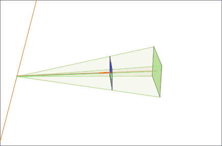
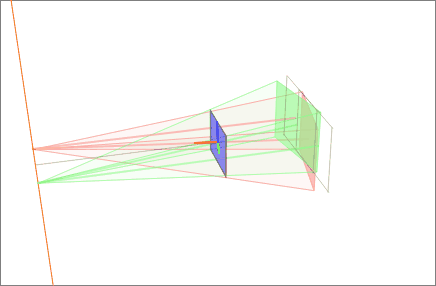
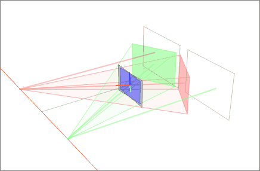
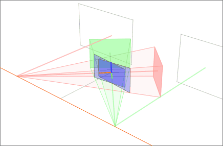

# Image Rectification
Image rectification is transforming an image of a scene into a view that is aligned with a desired coordinate system. The goal of rectification is to remove the effects of camera perspective, rotation, and lens distortion, so that the resulting image has a uniform scale and appears to be captured from a front-facing perspective. 


In the following:
 
- The camera rotating around the `z` axis.
- The virtual image plane at `5°` degree is red and at `90°` is green. 
- The rectified images are in the blue virtual image plane. 
- The virtual plane must be parallel to the stereo baseline (orange). 


|   |   |
|---|---|
|    |  |
|   |   |


# Image Rectification Algorithms
All rectified images satisfy the following two properties:
- All epipolar lines are parallel to the horizontal axis.
- Corresponding points have identical vertical coordinates.

## Projective rectification
Projective rectification is the process of transforming an image so that all parallel lines in the image are transformed to be parallel in the new image. The goal of projective rectification is to obtain a view of the scene that is orthographic or fronto-parallel. Projective rectification can be performed using a homography matrix, which maps points from one image to the other.

```
import cv2
import numpy as np

# Load the two images
img1 = cv2.imread('img1.jpg')
img2 = cv2.imread('img2.jpg')

# Find the homography matrix using the findHomography function
homography, _ = cv2.findHomography(src_points, dst_points)

# Use the perspectiveTransform function to project the second image onto the first image
img2_rectified = cv2.warpPerspective(img2, homography, (img1.shape[1], img1.shape[0]))

# Show the rectified images
cv2.imshow("Rectified Image 1", img1)
cv2.imshow("Rectified Image 2", img2_rectified)
cv2.waitKey(0)
cv2.destroyAllWindows()
```


## Epipolar Rectification
Epipolar rectification, on the other hand, is the process of rectifying two images such that the epipolar lines in the two images are aligned. The epipolar lines are the lines that intersect the two images and correspond to a single 3D point in the scene. The goal of epipolar rectification is to simplify the problem of finding corresponding points in two images, as the epipolar lines provide a unique constraint on the corresponding points.

```
import cv2
import numpy as np

# Load the two images
img1 = cv2.imread('img1.jpg')
img2 = cv2.imread('img2.jpg')

# Find the fundamental matrix using the findFundamentalMat function
F, mask = cv2.findFundamentalMat(src_points, dst_points)

# Use the stereoRectify function to obtain the rectification matrices for the two images
rectification_matrix1, rectification_matrix2, projection_matrix1, projection_matrix2, Q, roi1, roi2 = cv2.stereoRectify(
    cameraMatrix1, distCoeffs1, cameraMatrix2, distCoeffs2, (img1.shape[1], img1.shape[0]), F, (0, 0))

# Use the initUndistortRectifyMap function to obtain the maps for the rectification
mapx1, mapy1 = cv2.initUndistortRectifyMap(
    cameraMatrix1, distCoeffs1, rectification_matrix1, projection_matrix1, (img1.shape[1], img1.shape[0]), cv2.CV_32FC1)
mapx2, mapy2 = cv2.initUndistortRectifyMap(
    cameraMatrix2, distCoeffs2
```

##  Computing The Rectification Matrices

```
import numpy as np

# Define the fundamental matrix
F = np.array([[1.2, 0.3, 0.1], [0.1, 1.0, 0.2], [0.3, 0.1, 0.9]])

# Compute the epipole in image 2
e2 = np.matmul(F.transpose(), np.array([0, 0, 1]))

# Normalize the epipole to have a homogeneous coordinate of 1
e2 /= e2[2]

# Compute the rotation matrix to align the epipole with the y-axis
R = np.array([[e2[0], -e2[1], 0], [e2[1], e2[0], 0], [0, 0, 1]])

# Compute the rectification matrix for image 2
H2 = np.matmul(R, np.array([[1, 0, -e2[0]/e2[2]], [0, 1, -e2[1]/e2[2]], [0, 0, 1]]))

# Compute the rectification matrix for image 1
H1 = np.matmul(np.linalg.inv(H2), np.matmul(F, H2))


```


Refs [1](https://en.wikipedia.org/wiki/Image_rectification), [2](https://www.cs.cmu.edu/~16385/s17/Slides/13.1_Stereo_Rectification.pdf)
