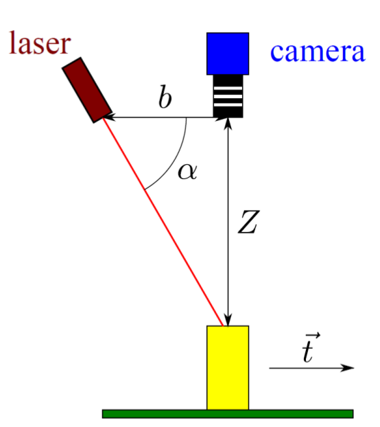

Refs: [1](https://www.researchgate.net/publication/283108894_Efficient_Completeness_Inspection_Using_Real-Time_3D_Color_Reconstruction_with_a_Dual-Laser_Triangulation_System), [2](https://www.movimed.com/knowledgebase/what-is-laser-triangulation/#:~:text=Laser%20Triangulation%20is%20a%20machine,illumination%20source%20with%20a%20camera.), [3](https://pdfs.semanticscholar.org/21b4/734cde678d97053ec214961214ca0d119f55.pdf)
