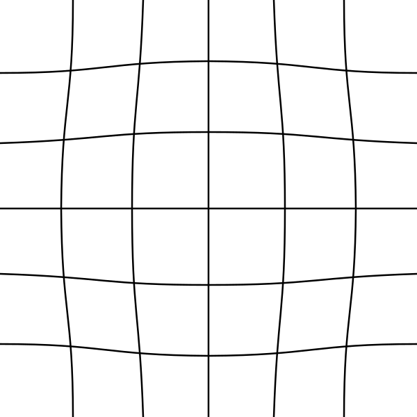
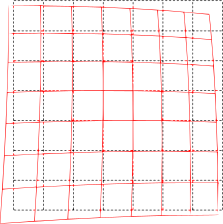
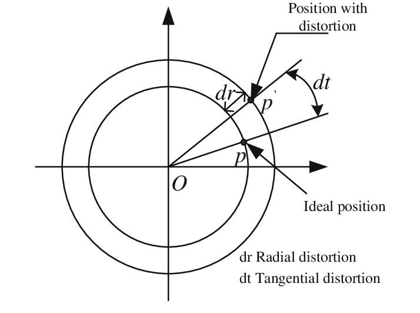
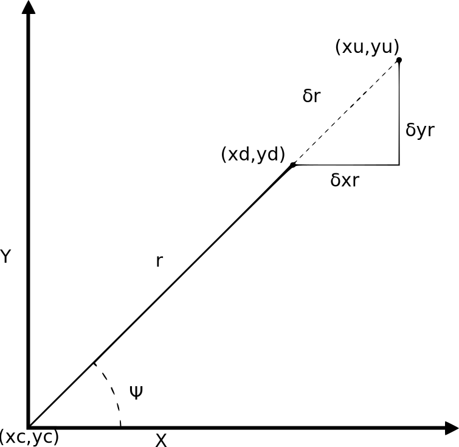

# 1. Lenses Distortion

## 1.1 Radial Distortions

The lens isn't a perfect pinhole, which has the side consequence of causing symmetric radial distortion. Outside of the perspective center, light enters the lens and bends toward the image plane. The best way to understand symmetric radial distortion could be to imagine that the concavity or convexity of the lens is being used to map the image plane. Because all light passes through a single point in a pinhole camera, there would be no distortion.


Because it solely models distortion as a function of distance from the center of the image plane, this distortion is described as being symmetric. Radial distortion only has a geometric impact in the radial direction,


## 1.1 Pincushion Distortion (Positive Radial Distortions)

pincushion distortion   monotonically increasing

i.e  


## 1.2 Barrel Distortion (Negative Radial Distortions)

In barrel distortion  monotonically decreasing

i.e  


## 1.3 Mustache Distortion



## 1.4 Tangential Distortions
Decentering distortion is a result of the lens assembly not being centered over and parallel to the image plane as the main reason.


|   |   |
|---|---|
|   |    |
|[image courtesy](https://www.tangramvision.com/blog/camera-modeling-exploring-distortion-and-distortion-models-part-i)   |      [image courtesy](https://www.researchgate.net/publication/260728375_Laboratory_calibration_of_star_sensor_with_installation_error_using_a_nonlinear_distortion_model)  |


# 2. OpenCV Lens Distortion Model


The distortion parameters:
1. Radial coefficients .
2. Tangential distortion coefficients . 
3. Thin prism distortion coefficients 


In the presence of tangential distortion, model is extended as:


where


Radial distortion is always monotonic for real lenses, and if the estimator produces a non-monotonic result, this should be considered a calibration failure.A failed estimation result may look deceptively good near the image center but will work poorly in e.g. AR/SFM applications. The optimization method used in OpenCV camera calibration does not include these constraints as the framework does not support the required integer programming and polynomial inequalities. See issue [#15992](https://github.com/opencv/opencv/issues/15992) for additional information.


# 3. Image Resolution and Distortion Coefficient
The distortion coefficients  
do not depend on the scene viewed and they remain the **same** regardless of image resolution. If, for example, a camera has been calibrated on images of 320 x 240 resolution, absolutely the same distortion coefficients can be used for 640 x 480 images from the same camera

However, , , , and  need to be scaled appropriately.

```
fx.new=(new width resolution/old width resolution)*fx.old
fy.new=(new height resolution/old height resolution)*fy.old

cx.new=(new width resolution/old width resolution)*cx.old
cy.new=(new height resolution/old height resolution)*cy.old
```
Refs: [1](https://stackoverflow.com/questions/44888119/c-opencv-calibration-of-the-camera-with-different-resolution),


# 4. Distortion Models

## 4.1  Brown-Conrady

The Brown-Conrady model corrects both for radial distortion and for tangential distortion as a series of higher order polynomial. In the following all points are n the image plane with Cartesian coordinate and not pixel based coordinate.

### 4.1.1 Radial Distortion


<br/>
<br/>


<br/>
<br/>


<br/>


 is the distorted image point

<br/>

 is the undistorted image point

<br/>

 is the distortion center

<br/>

<br/>
<br/>


<br/>
<br/>

### 4.1.2 Tangential distortion:
<br/>
<br/>


<br/>


<br/>
<br/>

### 4.1.3  Both Distortion Together

<br/>
<br/>


<br/>

 is the  radial distortion coefficient.

<br/>


 is the  tangential distortion coefficient.

In practice, only the ,  and  and ,  
terms are typically used


- Barrel distortion typically will have a negative term for  
- Pincushion distortion will have a positive value for  . 
- Moustache distortion will have a non-monotonic radial geometric series where for some  the sequence will change sign.


## 4.2  Division Model


provides a more accurate approximation than Brown-Conrady's even-order polynomial model. For radial distortion, this division model is often preferred over the Brown–Conrady model, as it requires fewer terms to more accurately describe severe distortion


Refs: [1](https://www.tangramvision.com/blog/camera-modeling-exploring-distortion-and-distortion-models-part-i),
[2](https://www.robots.ox.ac.uk/~vgg/publications/2001/Fitzgibbon01b/fitzgibbon01b.pdf), [3](https://www.microsoft.com/en-us/research/wp-content/uploads/2016/02/tr98-71.pdf), [4](https://ori.codes/artificial-intelligence/camera-calibration/camera-distortions/), [5](https://docs.opencv.org/4.x/dc/dbb/tutorial_py_calibration.html)


