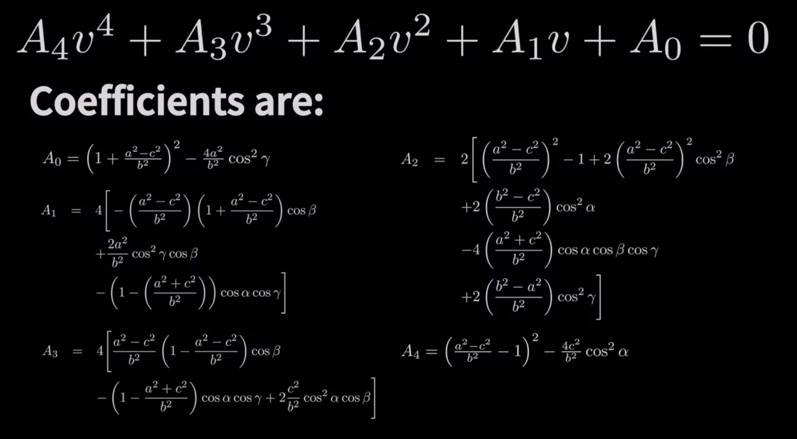
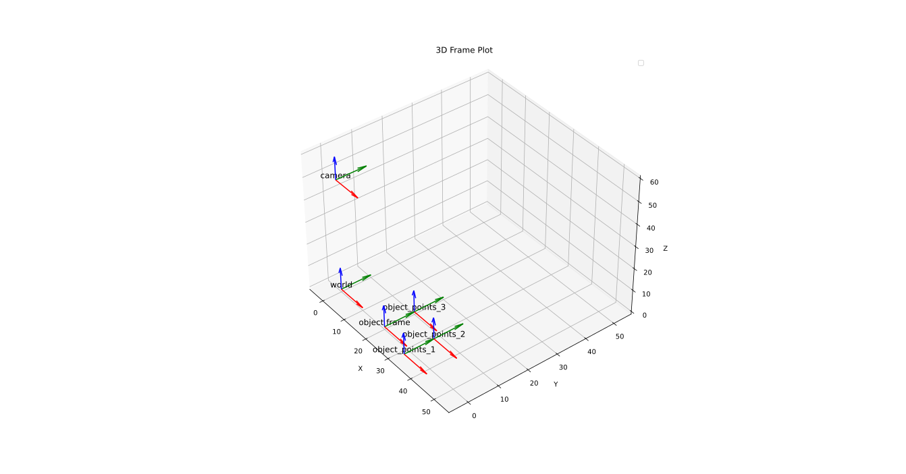
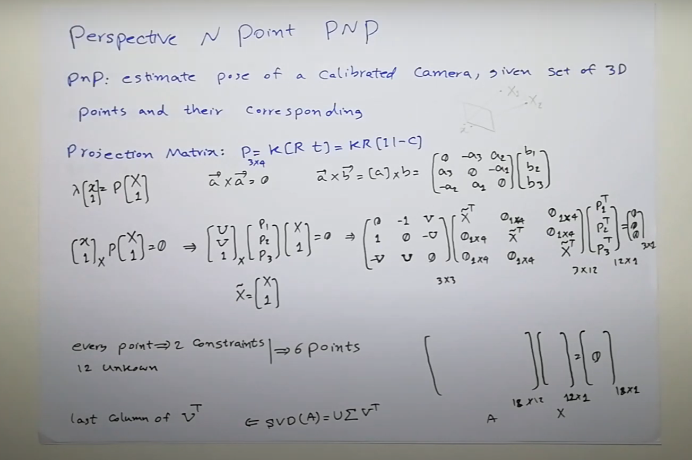

# Perspective-n-Point
Perspective-n-Point is the problem of estimating the pose of a **calibrated** camera given a set of n 3D points in the world and their correspondence projection point in the camera.

# P3P


First step: using cosine to relate the length in 4 triangles in the tetrahedron:


 


second step:




which gives us for possible solution so we need a 4th point or initial guess.


The solution looks like these 4 tetrahedrons:


<br/>
<br/>

```cpp
solveP3P	(	InputArray 	objectPoints,
InputArray 	imagePoints,
InputArray 	cameraMatrix,
InputArray 	distCoeffs,
OutputArrayOfArrays 	rvecs,
OutputArrayOfArrays 	tvecs,
int 	flags 
)	
```

## Critical Cylinder


The solution gets in-stable


Refs: [1](https://www.youtube.com/watch?v=N1aCvzFll6Q), [2](https://www.cis.upenn.edu/~cis580/Spring2015/Lectures/cis580-13-LeastSq-PnP.pdf), [3](https://www.youtube.com/watch?v=xdlLXEyCoJY)


# PnP

The `cv::solvePnP()` returns the rotation and the translation vectors that transform a 3D point expressed in the **object coordinate frame** to the **camera coordinate frame**,


```cpp
bool cv::solvePnP	(	InputArray 	objectPoints,
InputArray 	imagePoints,
InputArray 	cameraMatrix,
InputArray 	distCoeffs,
OutputArray 	rvec,
OutputArray 	tvec,
bool 	useExtrinsicGuess = false,
int 	flags = SOLVEPNP_ITERATIVE 
)	
```


`useExtrinsicGuess`:	Parameter used for `SOLVEPNP_ITERATIVE`. If true (1), the function uses the provided `rvec` and `tvec` values as initial


With SOLVEPNP_ITERATIVE method and useExtrinsicGuess=true, the minimum number of points is 3 (3 points are sufficient to compute a pose but there are up to 4 solutions). The initial solution should be close to the global solution to converge.


Refs: [1](https://docs.opencv.org/4.x/d5/d1f/calib3d_solvePnP.html), [2](https://docs.opencv.org/4.x/d9/d0c/group__calib3d.html#ga549c2075fac14829ff4a58bc931c033d)




```bash
object_points:
 [[ 0.  0.  0.]
 [10.  0.  0.]
 [10. 10.  0.]
 [ 0. 10.  0.]]
rotation of object in camera: 
 [[0.813104  ]
 [0.00000002]
 [3.03454547]] 
 translation of object in camera:
 [[-20.00000019]
 [ -0.00000006]
 [ 50.00000046]]
```





[code](script/perspective-n-point.py)


