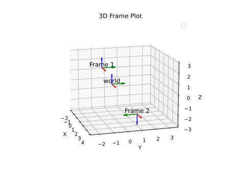

Example usage:
```python

    fig = plt.figure()
    ax = fig.add_subplot(111, projection='3d')

    # world
    length = 1.0
    x, y, z = 0, 0, 0
    q = [1, 0, 0, 0]

    plot_frame(ax, x, y, z, q, length, "world")

    # First frame
    x1, y1, z1 = 1, -1, 2
    q1 = [1, 0, 0, 0]  # Identity quaternion, no rotation

    plot_frame(ax, x1, y1, z1, q1, length, "Frame 1")

    # Optionally, add a second frame or other plot elements
    x2, y2, z2 = 3, 1, -2
    q2 = [0, 1, 0, 0]

    plot_frame(ax, x2, y2, z2, q2, length, "Frame 2")

    ax.set_xlabel('X')
    ax.set_ylabel('Y')
    ax.set_zlabel('Z')
    ax.set_title('3D Frame Plot')
    ax.legend()

    plt.show()
```



[code](../scripts/plot_frame_poses_in_3d.py)
