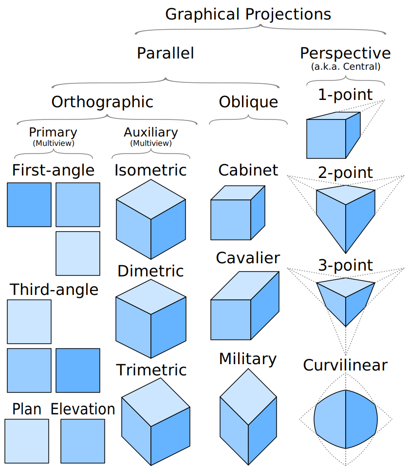
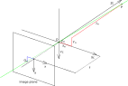
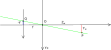
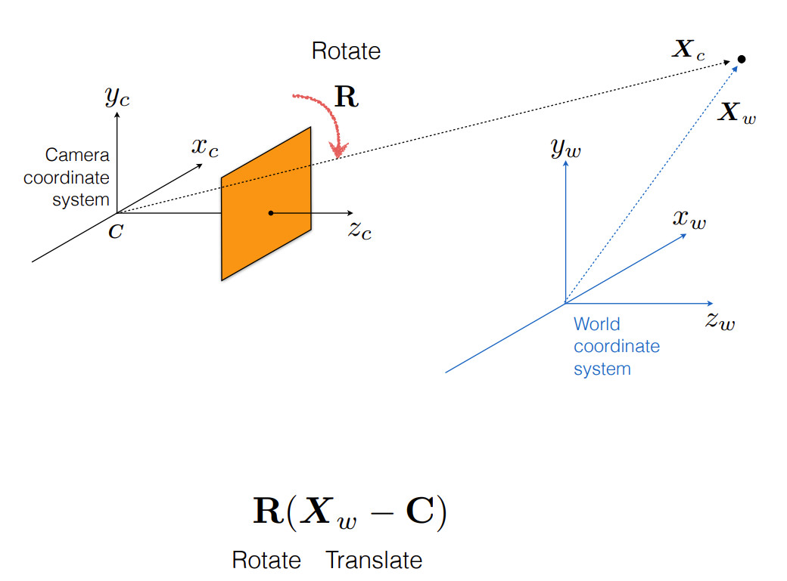
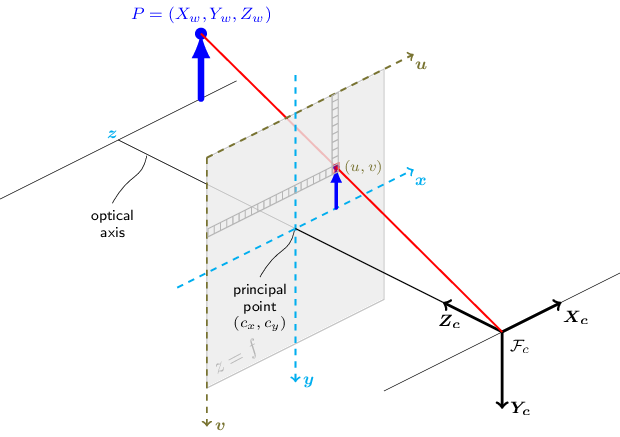
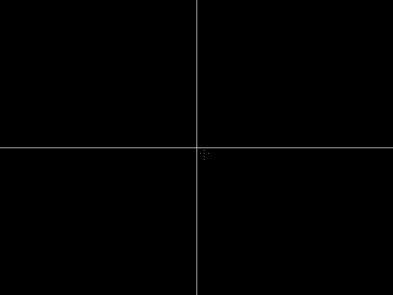

# 1. Graphical Projection

There are two graphical projection categories:

- parallel projection
- perspective projection





# 2. Pinhole Camera Model

the coordinates  of point  depend on the coordinates of point  

- 

- 






Refs: [1](https://en.wikipedia.org/wiki/Pinhole_camera_model#Geometry),
[2](https://ksimek.github.io/2013/08/13/intrinsic/),


## 2.1 Rotated Image and the Virtual Image Plane

The mapping from 3D to 2D coordinates described by a pinhole camera is a perspective projection followed by a `180°` rotation in the image plane. This corresponds to how a real pinhole camera operates; the resulting image is rotated `180°` and the relative size of projected objects depends on their distance to the focal point and the overall size of the image depends on the distance f between the image plane and the focal point. In order to produce an unrotated image, which is what we expect from a camera we Place the image plane so that it intersects the  axis at `f` instead of at `-f` and rework the previous calculations. This would generate a virtual (or front) image plane which cannot be implemented in practice, but provides a theoretical camera which may be simpler to analyse than the real one.


## 2.2 Camera Resectioning and Projection Matrix 

Projection refers to the pinhole camera model, a camera matrix  is used to denote a projective mapping from world coordinates to pixel coordinates.

<br/>
<br/>
Assuming that the camera and world share the same coordinate system:

<br/>
<br/>

<br/>
<br/>


<br/>
<br/>
If they are different:

<br/>
<br/>


[image courtesy](https://www.cs.cmu.edu/~16385/s17/Slides/11.1_Camera_matrix.pdf)
 

<br/>
<br/>


<br/>
<br/>


<br/>
<br/>


 represent a 2D point position in pixel coordinates and  represent a 3D point position in world coordinates.


<br/>
<br/>


<br/>
<br/>


<br/>
<br/>

    


<br/>
<br/>


    

<br/>
<br/>


<br/>
<br/>


<br/>
<br/>


<br/>
<br/>


<br/>
<br/>
so the projection of the point is at `(u,v)`, Please note that `u` will increase from left to right and `v` will increase from top to bottom 


<br/>
<br/>


```cpp
              u                      
    ------------------------------------------►
    | (0,0) (1,0) (2,0) (3,0) (u,v) (u+1,v)
    | (0,1) (1,1) (2,1) (3,1)
    | (0,2) (1,2) (2,2) (3,2)
  v | (u,v)
    | (u,v+1)
    |
    |
    ▼

```


## 2.3 Example of Projection 


<br/>
<br/>


<br/>
<br/>


<br/>
<br/>


<br/>
<br/>


<br/>
<br/>


<br/>
<br/>

<br/>
<br/>


<br/>
<br/>


<br/>
<br/>


<br/>
<br/>


<br/>
<br/>


projected pints in camera:

<br/>
<br/>


<br/>
<br/>





<br/>
<br/>




## 2.4 Image coordinate and Matrix coordinate

In OpenCV, `Point(x=u=column,y=v=row)`. For instance the point in the following image can be accessed with

```cpp
              x=u                      
    --------column---------►
    | Point(0,0) Point(1,0) Point(2,0) Point(3,0)
    | Point(0,1) Point(1,1) Point(2,1) Point(3,1)
    | Point(0,2) Point(1,2) Point(2,2) Point(3,2)
 y=v|
   row
    |
    |
    ▼

```
However if you access an image directly, the access is matrix based index, the order is 

```cpp
    X                      
    --------column---------►
    | mat.at<type>(0,0) mat.at<type>(0,1) mat.at<type>(0,2) mat.at<type>(0,3)
    | mat.at<type>(1,0) mat.at<type>(1,1) mat.at<type>(1,2) mat.at<type>(1,3)
    | mat.at<type>(2,0) mat.at<type>(2,1) mat.at<type>(2,2) mat.at<type>(2,3)
  y |
   row
    |
    |
    ▼
```    


So the following will return the same value:


```cpp
mat.at<type>(row,column) 
mat.at<type>(cv::Point(column,row))
```
For instance:
```cpp
std::cout<<static_cast<unsigned>(img.at<uchar>(row,column))    <<std::endl;
std::cout<<static_cast<unsigned>(img.at<uchar>( cv::Point(column,row))     )<<std::endl;
```


## 2.5 Projection with Lens Distortion


## 2.6 Undistorting Points

### 2.6.1 initUndistortRectifyMap
The following function computes the `undistortion` and `rectification transformation`. The undistorted is image that has been captured with a camera using the `camera matrix =newCameraMatrix` and zero distortion.

1. In case of a monocular camera, `newCameraMatrix` is usually equal to `cameraMatrix` or it can be computed by getOptimalNewCameraMatrix for a better control over scaling.

2. In case of a stereo camera, `newCameraMatrix` is normally set to `P1` or `P2` computed by `stereoRectify` .


```cpp
void cv::initUndistortRectifyMap	(	InputArray 	cameraMatrix,
InputArray 	distCoeffs,
InputArray 	R,
InputArray 	newCameraMatrix,
Size 	size,
int 	m1type,
OutputArray 	map1,
OutputArray 	map2 
)	
```


**Parameters:**

1. `cameraMatrix`:
<br/>
 

2. `distCoeffs`: input vector of distortion coefficients 4, 5, 8, 12 or 14 elements:

 

3. `R`: Optional rectification transformation in the object space (3x3 matrix). `R1 `or `R2` , computed by `stereoRectify` can be passed here. If the matrix is empty, the identity transformation is assumed. In `initUndistortRectifyMap` R is assumed to be an identity matrix.


4. `newCameraMatrix`: New camera matrix


For each observed point coordinate (u,v) the function computes:


<br/>
<br/>


<br/>
<br/>


where  are the distortion coefficients.


In case of a stereo camera, this function is called twice: once for each camera head, after `stereoRectify`, which in its turn is called after `stereoCalibrate`. But if the stereo camera was not calibrated, it is still possible to compute the rectification transformations directly from the fundamental matrix using `stereoRectifyUncalibrated`. For each camera, the function computes `homography H` as the rectification transformation in a pixel domain, not a rotation matrix` R` in 3D space. `R` can be computed from H as


Refs: [1](https://docs.opencv.org/3.4/da/d54/group__imgproc__transform.html#ga7dfb72c9cf9780a347fbe3d1c47e5d5a)


### 2.6.2 undistort
This function is similar to `initUndistortRectifyMap` but it operates on a sparse set of points
```cpp
void cv::undistortPoints	(	InputArray 	src,
OutputArray 	dst,
InputArray 	cameraMatrix,
InputArray 	distCoeffs,
InputArray 	R = noArray(),
InputArray 	P = noArray() 
)
```
For each observed point coordinate (u,v) the function computes:

Refs: [1](https://docs.opencv.org/3.4/da/d54/group__imgproc__transform.html#ga69f2545a8b62a6b0fc2ee060dc30559d)


# 3D World Unit Vector


Refs: [1](https://docs.opencv.org/3.4/da/d54/group__imgproc__transform.html#ga69f2545a8b62a6b0fc2ee060dc30559d)

# 3D World Unit Vector

Refs: [1](https://stackoverflow.com/questions/12977980/in-opencv-converting-2d-image-point-to-3d-world-unit-vector),
[2](https://docs.opencv.org/4.x/d9/d0c/group__calib3d.html),
[3](https://stackoverflow.com/questions/44888119/c-opencv-calibration-of-the-camera-with-different-resolution),
[4](https://docs.opencv.org/3.2.0/da/d54/group__imgproc__transform.html#ga55c716492470bfe86b0ee9bf3a1f0f7e),
[5](https://www.mathematik.uni-marburg.de/~thormae/lectures/graphics1/graphics_6_1_eng_web.html#1)


# Resizing Image Effect on the Camera Intrinsic Matrix


