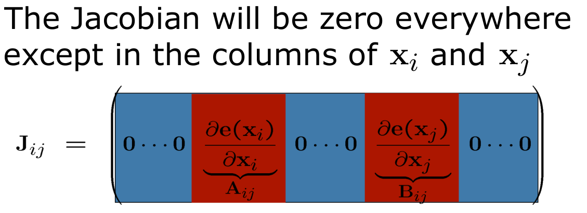
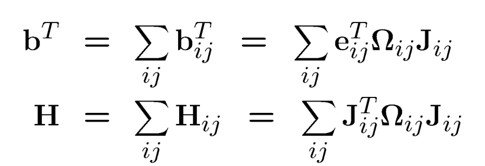
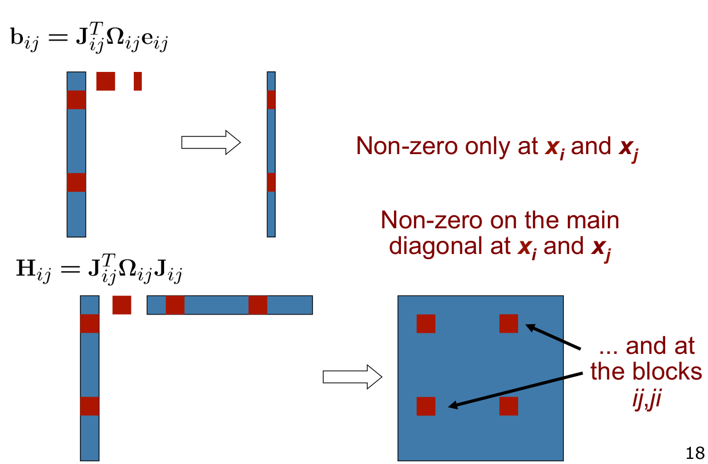
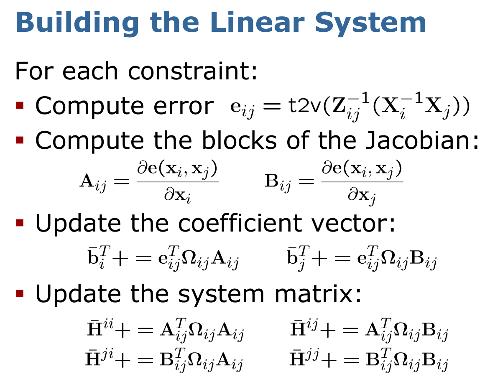
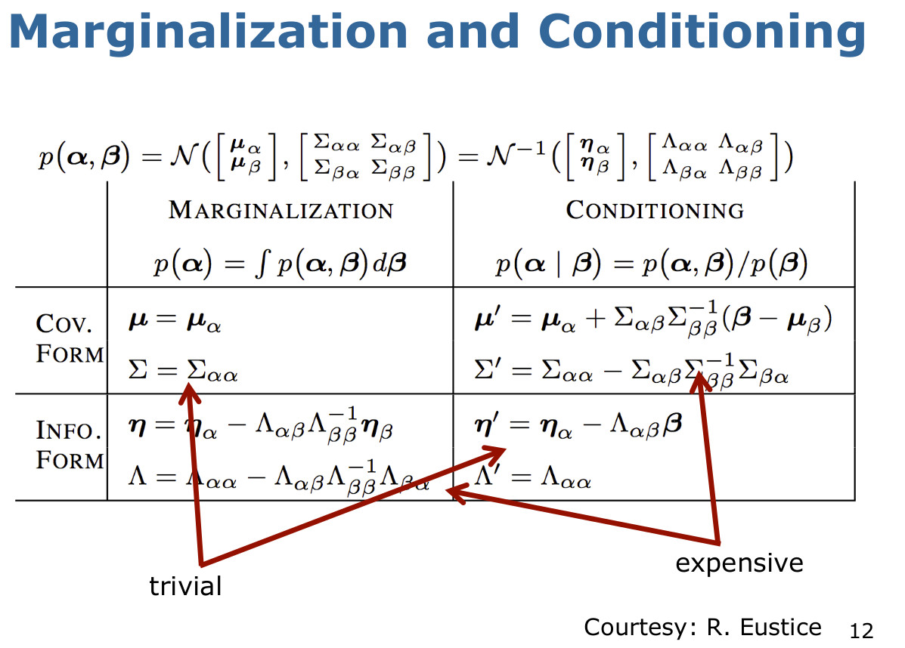

# SLAM


# GraphSLAM


1. 

2. 

which gives us: 
- 


- 


our state is:
<br/>


<br/>

our error function is:
<br/>


<br/>
<br/>


<br/>
<br/>


<br/>
<br/>


<br/>
<br/>




<br/>
<br/>


<br/>
<br/>


<br/>
<br/>



Refs: [1](https://python-graphslam.readthedocs.io/en/stable/)


# g2o 
g2o is a C++ framework for optimizing graph-based nonlinear error functions
```
git clone https://github.com/gabime/spdlog.git
cmake -S . -B build -DCMAKE_INSTALL_PREFIX=/home/behnam/usr -DSPDLOG_BUILD_SHARED=ON
cmake --build build
cmake --install build
```

`sudo apt install libsuitesparse-dev qtdeclarative5-dev qt5-qmake libqglviewer-dev-qt5`


```
git clone https://github.com/RainerKuemmerle/g2o/
cmake -S . -B build -DCMAKE_INSTALL_PREFIX=/home/behnam/usr -DSPDLOG_BUILD_SHARED=ON
cmake --build build
cmake --install build
```

## g2o-python


```
pip install -U g2o-python
```
Refs: [1](https://github.com/miquelmassot/g2o-python)


## File Format SLAM 2D

In a graph-based optimization problem, you typically have a set of variables (also known as nodes) and constraints (also known as edges) between these variables. The g2o format provides a way to express these variables and constraints in a text-based file.

The g2o file consists of several sections, each indicated by a specific keyword:


## Vertices
syntax: 

`TAG ID CURRENT_ESTIMATE`

Examples:


### 2D Robot Pose

`VERTEX_SE2 i x y theta`

`VERTEX_SE2 4 0.641008 -0.011200 -0.007444`

### 2D Landmarks / Features

`VERTEX_XY i x y`

### Edges / Constraints

`TAG ID_SET MEASUREMENT INFORMATION_MATRIX`

The odometry of a robot connects subsequent vertices with a **relative transformation** which specifies how the robot moved according to its measurements. For a compact documentation we employ the following helper function.

`EDGE_SE2 i j x y theta info(x, y, theta)`

Where  is the measurement moving from   to , i.e. 


`EDGE_SE2 24 25 0.645593 0.014612 0.008602 11.156105 -3.207460 0.000000 239.760661 0.000000 2457.538661`


## File Format SLAM 3D

### 3D Robot Pose

`VERTEX_SE3:QUAT i x y z qx qy qz qw`

`VERTEX_SE3:QUAT 0 0 0 0 0 0 1`

### 3D Point


`VERTEX_TRACKXYZ i x y z`

### Edges / Constraints


`EDGE_SE3:QUAT 0 1 0 0 0 0 0 0 0 1 0 0 0 0.1 0 0 0 0.1 0 0.1 0.1 0.1 0.1`

`ID_SET`: is a list of vertex IDs which specifies to which vertices the edge is connected.

`MEASUREMENT` : The information matrix or precision matrix which represent the uncertainty of the measurement error is the inverse of the covariance matrix. Hence, it is symmetric and positive semi-definite. We typically only store the upper-triangular block of the matrix in row-major order. For example, if the information matrix  is a `3x3`  


[Examples](https://github.com/RainerKuemmerle/g2o/tree/pymem/python/examples)


Refs: [1](https://github.com/RainerKuemmerle/g2o/wiki/File-Format-SLAM-2D)


## Multivariate Gaussians

### Moments parameterization


## Canonical Parameterization
Alternative representation for Gaussians


<br/>



<br/>

## Further reading


- simple_2d_slam
Refs: [1](https://github.com/goldbattle/simple_2d_slam)

- Robust Pose-graph Optimization
Refs: [1](https://www.youtube.com/watch?v=zOr9HreMthY)

- Awesome Visual Odometry
Refs: [1](https://github.com/chinhsuanwu/awesome-visual-odometry)

- Monocular Video Odometry Using OpenCV
Refs: [1](https://github.com/alishobeiri/Monocular-Video-Odometery)

- modern-slam-tutorial-python
Refs: [1](https://github.com/gisbi-kim/modern-slam-tutorial-python)

- Monocular-Video-Odometery
Refs: [1](https://github.com/alishobeiri/Monocular-Video-Odometery/blob/master/monovideoodometery.py)
  
- Matrix Lie Groups for Robotics
Refs: [1](https://www.youtube.com/watch?v=NHXAnvv4mM8&list=PLdMorpQLjeXmbFaVku4JdjmQByHHqTd1F&index=8)   

- Factor Graph - 5 Minutes with Cyrill
Refs: [1](https://www.youtube.com/watch?v=uuiaqGLFYa4&t=145s)

- GTSAM: Georgia Tech Smoothing and Mapping Library  
Refs [1](https://gtsam.org/), [2](https://github.com/borglab/gtsam)

- DBoW2: library for indexing and converting images into a bag-of-word representation  
Refs: [1](https://github.com/dorian3d/DBoW2)

- iSAM: Incremental Smoothing and Mapping  
Refs: [1](https://openslam-org.github.io/iSAM)


## python-graphslam

Refs: [1](https://github.com/JeffLIrion/python-graphslam), [2](https://python-graphslam.readthedocs.io/en/stable/)


## add apriltag to loop closure

Refs: [1](https://berndpfrommer.github.io/tagslam_web/)


## DROID-SLAM

## Hierarchical-Localization

## image-matching-webui

## LightGlue

## Nerf-SLAM

## DenseSFM

Refs: [1](https://github.com/tsattler/visuallocalizationbenchmark)

## Pixel-Perfect Structure-from-Motion
Refs: [1](https://github.com/cvg/pixel-perfect-sfm)

## ODM
```
docker run -ti --rm -v /home/$USER/workspace/odm_projects/datasets/code/:/datasets/code opendronemap/odm --project-path /datasets
```
[Datasets](https://www.opendronemap.org/odm/datasets/)

## GTSAM
Refs: [1](https://www.youtube.com/watch?v=zOr9HreMthY)
