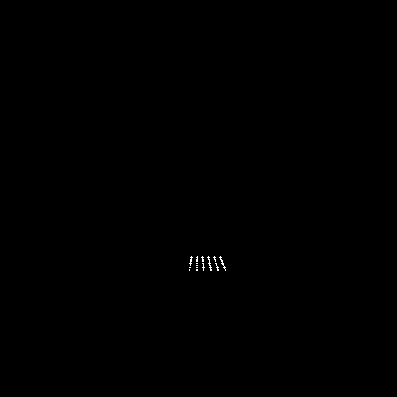

# Stereo Calibration

<table>
<tr>
	<td>
		
	</td>
	<td>
		
	</td>
<tr>

</table>


```phyton
retval, cameraMatrix1, distCoeffs1, cameraMatrix2, distCoeffs2, R, T, E, F = cv2.stereoCalibrate(
    objectPoints, all_imagePoints_cam0, all_imagePoints_cam1, cameraMatrix, distCoeffs, cameraMatrix, distCoeffs, imageSize)
```

[code](../scripts/multi_snapshot_stereo.py)
